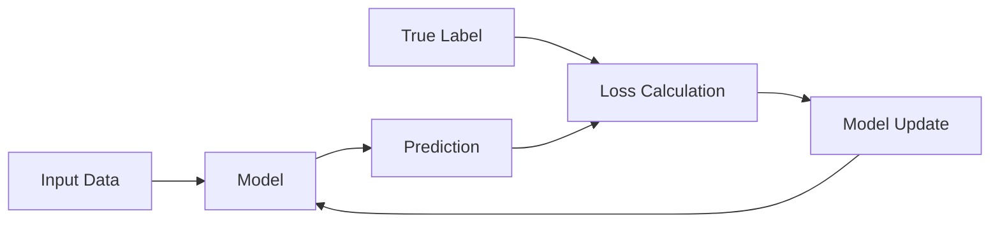
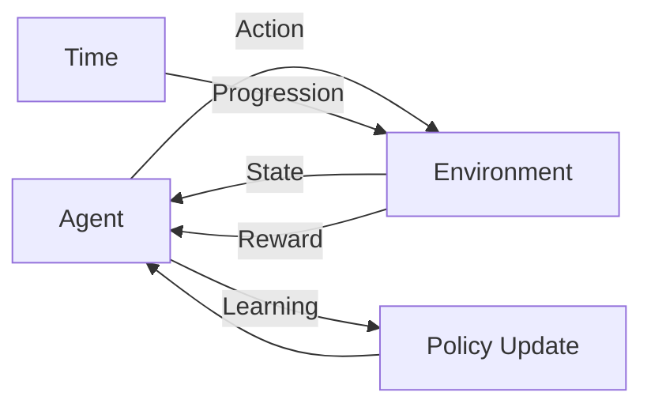
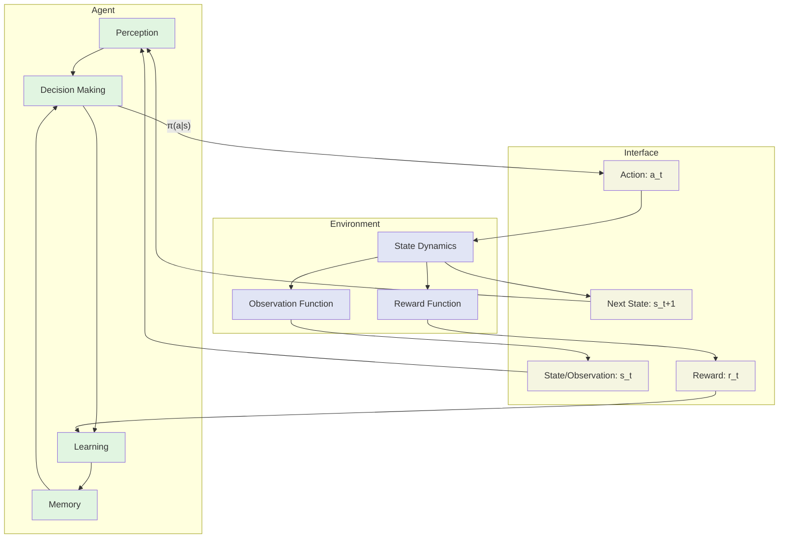
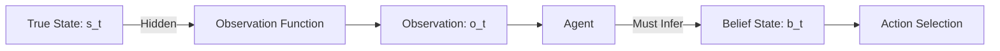
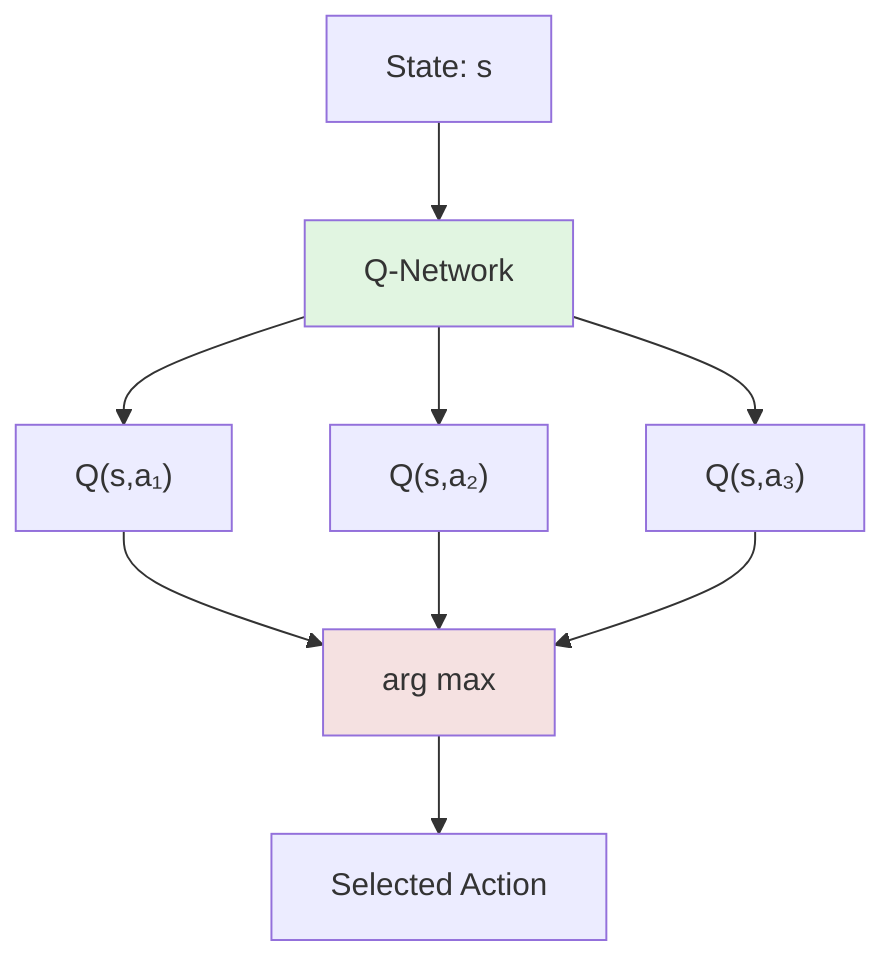
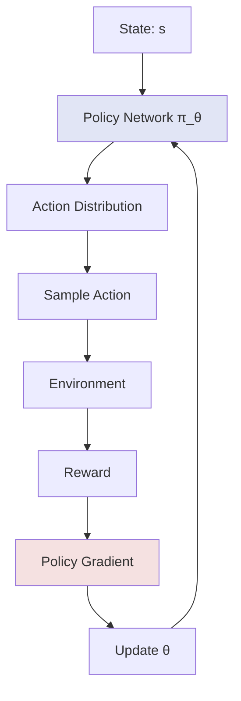
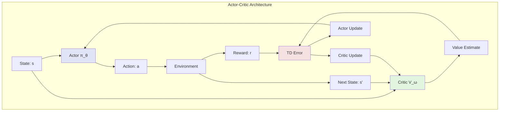
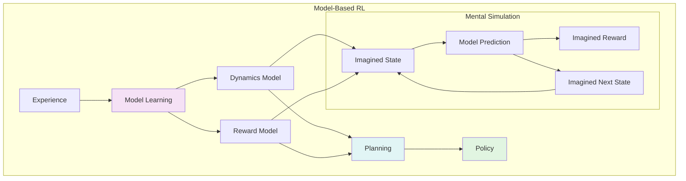
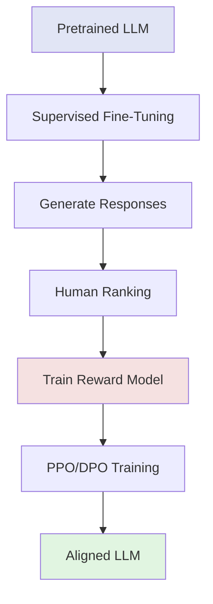

# Chapter 1: The Reinforcement Learning Paradigm

## Core Thesis: Learning through Consequence

Imagine teaching a child to ride a bicycle. You don't hand them a manual detailing the precise angles of lean for every possible velocity and turning radius. You don't show them millions of labeled examples of "correct" and "incorrect" riding positions. Instead, you put them on the bike, let them wobble, fall, succeed, and gradually discover—through the immediate feedback of balance and motion—how to ride. This is reinforcement learning in its purest form: intelligence emerging from the interplay of action and consequence.

Reinforcement Learning (RL) represents a fundamental departure from how we typically think about machine learning. While supervised learning asks "What is the correct label for this input?" and unsupervised learning asks "What patterns exist in this data?", RL poses a more profound question: "What sequence of actions should I take to achieve my goals?"

This shift from passive pattern recognition to active decision-making transforms machine learning from a tool of analysis into an engine of behavior. In RL, an agent doesn't merely classify or cluster—it acts, observes the consequences, and learns to act better. This learning-by-doing paradigm mirrors how biological intelligence evolved: through millions of years of organisms taking actions, experiencing outcomes, and adapting their behavior accordingly.

The power of this approach lies in its generality. Whether we're training a robot to walk, teaching an AI to play chess, fine-tuning a language model to be more helpful, or discovering new materials through automated experimentation, the core loop remains the same: act, observe, adapt. This universality has made RL the backbone of many of AI's most impressive achievements, from AlphaGo's superhuman Go play to ChatGPT's helpful responses.

## Distinguishing RL: A Deep Dive on the Differences from Supervised/Unsupervised Learning

To truly understand RL's unique position in the machine learning landscape, we must examine how it differs from its more familiar cousins. These differences aren't merely academic—they fundamentally change how we approach problems, design systems, and think about intelligence itself.

### The Supervision Spectrum

**Supervised Learning** operates in a world of certainty. Every input has a correct output, provided by an omniscient teacher. The learning process resembles a student memorizing answer keys: for image X, the label is "cat"; for email Y, the classification is "spam." The objective is clear: minimize the difference between predictions and ground truth labels.

**Unsupervised Learning** removes the teacher but maintains passivity. The algorithm discovers structure—clusters, dimensions, patterns—but doesn't act on the world. It's like an art critic analyzing paintings, finding themes and styles, but never picking up a brush.

**Reinforcement Learning** introduces agency and temporal complexity. There's no omniscient teacher providing correct actions. Instead, the environment provides rewards—sometimes immediately, often delayed, always dependent on the agent's choices. The agent must not only learn what's good but also discover it through exploration.

### The Credit Assignment Challenge

Consider training a model to play chess. In supervised learning, we might show it millions of grandmaster games, teaching it to mimic expert moves. But RL faces a harder problem: if the agent wins a game, which of its 50 moves deserved credit? If it loses, which decisions were mistakes? This temporal credit assignment problem—connecting distant consequences to past actions—lies at the heart of RL's complexity.

This challenge doesn't exist in supervised learning, where feedback is immediate and specific to each prediction. In RL, an action's true value might only become apparent hundreds of steps later. The agent must learn to propagate these delayed signals backward through time, building an understanding of long-term consequences.

### The Exploration Imperative

Supervised learning algorithms can be greedy—always choosing the most confident prediction causes no harm when training on a fixed dataset. But RL agents face a fundamental dilemma: should they exploit what they know works, or explore to discover something better?

This exploration-exploitation tradeoff has no parallel in supervised learning. An RL agent that only exploits might get stuck in suboptimal behaviors, never discovering better strategies. One that only explores might never capitalize on its learning. Balancing these competing needs requires sophisticated strategies that adapt over time.

### Distribution Shift as a Feature, Not a Bug

In supervised learning, distribution shift—when test data differs from training data—is a problem to be solved through careful data collection and domain adaptation. In RL, distribution shift is the entire point. As the agent learns and changes its behavior, it naturally encounters new situations. The distribution of states it experiences depends on its own actions, creating a feedback loop where learning changes the data distribution, which changes what needs to be learned.

This self-induced distribution shift makes RL both powerful and unstable. The agent shapes its own curriculum, potentially focusing on important states or getting stuck in unproductive cycles.

## The Anatomy of Intelligence: The Agent-Environment Interface

The agent-environment interface forms the conceptual backbone of all RL systems. This deceptively simple abstraction captures the essence of embedded intelligence: an agent taking actions in a world that responds with observations and rewards.

### The Agent: Embodied Decision-Making

The agent encompasses all components under the learning algorithm's control. At its core, the agent must:

1. **Perceive**: Transform raw observations into useful representations
2. **Decide**: Select actions based on current state and past experience  
3. **Learn**: Update behavior based on rewards and outcomes
4. **Remember**: Maintain information across time steps

Modern deep RL agents implement these functions through neural networks, but the conceptual separation remains crucial. The perception module might be a convolutional network processing pixels, the decision module a policy network outputting action probabilities, the learning module an optimization algorithm updating weights, and the memory module a replay buffer or recurrent states.

### The Environment: The World's Response

The environment embodies everything beyond the agent's direct control—the physics of a robotic arm, the rules of a game, the dynamics of a market, or the responses of users to a language model. The environment's responsibilities are mechanistic:

1. **Evolve State**: Update the world based on actions
2. **Calculate Rewards**: Evaluate the desirability of states/actions
3. **Provide Observations**: Show the agent what it can perceive

Crucially, the environment is not adversarial by default—it simply follows its rules. Whether these rules help or hinder the agent depends on the reward structure and dynamics.

### The Information Flow

At each time step $t$, a precise exchange occurs:

1. Environment provides state/observation $s_t$
2. Agent selects action $a_t \sim \pi(a|s_t)$ based on its policy
3. Environment transitions to new state $s_{t+1} \sim P(s'|s_t, a_t)$
4. Environment provides reward $r_t = R(s_t, a_t, s_{t+1})$
5. Agent updates its policy based on this experience

This loop continues until termination (if episodic) or indefinitely (if continuing). The simplicity of this interface belies its power—it can represent any sequential decision problem.

### Partial Observability: When the World is Hidden

Often, agents can't observe the complete environmental state. A poker-playing agent can't see opponents' cards; a robot might have limited sensors; a trading agent observes prices but not other traders' intentions. This partial observability transforms the problem from an MDP to a Partially Observable MDP (POMDP).

In POMDPs, optimal behavior requires maintaining beliefs about hidden states, often through recurrent networks or explicit state estimation. This adds layers of complexity but also realism—few real-world problems offer complete state visibility.

## A Taxonomy of RL Agents: Value-Based, Policy-Based, Actor-Critic, Model-Based

The diversity of RL algorithms can seem overwhelming, but they organize naturally along two fundamental axes: what the agent learns (values vs. policies) and whether it models the environment. Understanding this taxonomy provides a map for navigating the algorithmic landscape.

### Value-Based Methods: Learning What's Good

Value-based agents learn to estimate the long-term worth of states or state-action pairs, then act by choosing high-value options. The canonical example is Q-learning, which learns a function $Q(s,a)$ estimating the expected future reward for taking action $a$ in state $s$.

**Strengths:**
- Naturally handle discrete action spaces
- Strong theoretical foundations
- Can learn optimal policies off-policy

**Limitations:**
- Struggle with continuous action spaces
- May be sample-inefficient
- Policy is implicit (derived from values)

### Policy-Based Methods: Learning What to Do

Policy-based agents directly learn a mapping from states to actions, typically parameterized as $\pi_\theta(a|s)$. Rather than learning values and deriving actions, they optimize the policy parameters to maximize expected rewards.

**Strengths:**
- Natural for continuous action spaces
- Can learn stochastic policies
- Direct optimization of performance

**Limitations:**
- High variance in gradients
- Often on-policy (inefficient)
- Can converge to local optima

### Actor-Critic: The Best of Both Worlds

Actor-Critic methods combine policy-based (actor) and value-based (critic) approaches. The actor learns the policy while the critic learns values, providing lower-variance feedback for policy updates.

**Strengths:**
- Lower variance than pure policy methods
- More stable learning
- Flexible architecture

**Limitations:**
- More complex implementation
- Two sets of parameters to tune
- Potential for actor-critic lag

### Model-Based RL: Learning the Rules

Model-based agents learn an explicit model of environment dynamics $P(s'|s,a)$ and rewards $R(s,a)$. They can then plan using this model, potentially achieving better sample efficiency.

**Strengths:**
- Sample efficient
- Can leverage planning algorithms
- Enables mental simulation

**Limitations:**
- Model errors compound
- Computationally intensive planning
- Complex to implement well

### Hybrid Approaches and Modern Architectures

Modern RL often blends these categories. For example:

- **Model-Based Policy Optimization (MBPO)**: Uses a learned model to generate synthetic experience for policy training
- **Value-Guided Policy Search**: Uses value estimates to guide policy optimization
- **Implicit Models**: Learn representations that enable planning without explicit dynamics

The boundaries between categories continue to blur as researchers discover new ways to combine their strengths.

## Modern Applications: From Games to LLM Training

The evolution of RL from academic curiosity to transformative technology traces through its applications. Each breakthrough application not only demonstrated RL's power but also drove algorithmic innovation.

### Games: The Perfect Laboratory

Games provided RL's first major public victories. Their appeal goes beyond publicity:

- **Clear objectives**: Winning/scoring provides unambiguous rewards
- **Perfect information**: Complete state observability (in many games)
- **Safe exploration**: No real-world consequences for failures
- **Infinite data**: Can simulate millions of games

**Atari (2013-2015)**: Deep Q-Networks (DQN) learned to play 49 Atari games from raw pixels, matching or exceeding human performance in most. This demonstrated that RL could learn useful representations directly from high-dimensional sensory input.

**Go (2016-2017)**: AlphaGo's victory over world champions shattered assumptions about AI's limitations. The combination of Monte Carlo Tree Search with deep neural networks showed how RL could master problems with enormous state spaces (~10^170 positions).

**StarCraft II (2019)**: AlphaStar demonstrated RL in partially observable, multi-agent, real-time environments. The agent managed economy, army composition, and tactical execution across multiple time scales.

**Modern Game AI**: Today's game-playing agents exhibit creativity and adaptation that surprises even experts. They discover novel strategies, exploit game mechanics in unexpected ways, and demonstrate robust play against diverse opponents.

### Robotics: Bridging the Reality Gap

Robotics presents RL's most tangible challenges:

- **Sample efficiency**: Real-world interactions are slow and expensive
- **Safety**: Exploration can damage expensive hardware
- **Partial observability**: Limited sensors and occlusions
- **Non-stationarity**: Wear, tear, and environmental changes

Despite these challenges, RL has achieved remarkable robotic capabilities:

**Manipulation**: Robots learning to grasp diverse objects, assemble products, and perform delicate tasks like threading needles. Modern approaches combine simulation training with real-world fine-tuning.

**Locomotion**: Quadrupeds and bipeds learning natural gaits, recovering from perturbations, and navigating complex terrains. RL discovers controllers more robust than hand-engineered alternatives.

**Human-Robot Interaction**: Robots learning from human demonstrations and corrections, adapting to user preferences through interactive RL.

### Large Language Models: The New Frontier

The application of RL to LLMs represents a paradigm shift in how we train and deploy AI systems:

**Reinforcement Learning from Human Feedback (RLHF)**:

RLHF transformed LLMs from impressive but unreliable text generators into helpful, harmless assistants. The process:
1. Humans rank model outputs
2. Train reward model to predict rankings
3. Use RL to optimize for predicted rewards
4. Result: models that follow instructions, refuse harmful requests, and acknowledge uncertainty

**Constitutional AI and RLAIF**: Recent advances allow models to provide their own feedback, reducing human annotation needs while maintaining alignment.

**Reasoning and Problem-Solving**: DeepSeek's R1 model demonstrates how RL can induce chain-of-thought reasoning, mathematical problem-solving, and code generation capabilities that emerge from reward signals rather than supervised training.

### Scientific Discovery and Optimization

RL increasingly drives scientific breakthroughs:

**Drug Discovery**: RL agents designing molecular structures with desired properties, optimizing synthesis routes, and planning experiments.

**Materials Science**: Discovering new materials by navigating vast chemical spaces, optimizing properties like strength, conductivity, or catalytic efficiency.

**Experimental Control**: Managing complex experiments like plasma containment in fusion reactors, telescope scheduling, or particle accelerator tuning.

### Real-World Systems

Beyond research applications, RL quietly optimizes systems we interact with daily:

**Recommendation Systems**: Balancing exploration (showing diverse content) with exploitation (showing engaging content) to maximize long-term user satisfaction.

**Resource Management**: Data center cooling, traffic light control, power grid optimization—all benefiting from RL's ability to handle complex, dynamic systems.

**Finance**: Portfolio optimization, algorithmic trading, and market making, where RL agents learn to navigate stochastic, partially observable markets.

### The Common Thread

Across these diverse applications, common patterns emerge:

1. **Sequential Decision Making**: All involve taking actions over time
2. **Delayed Consequences**: Rewards often come after multiple steps
3. **Exploration Needs**: Optimal strategies aren't known a priori
4. **Complex State Spaces**: High-dimensional or partially observable
5. **Safety Requirements**: Real consequences for poor decisions

These shared characteristics explain why RL, despite its challenges, remains the tool of choice for these domains. As we develop better algorithms, more applications will join this list, further cementing RL's role as a cornerstone of artificial intelligence.

The journey from teaching computers to play Pong to aligning powerful language models illustrates RL's remarkable trajectory. Each application domain brings unique challenges that drive algorithmic innovation, creating a virtuous cycle of practical impact and theoretical advancement. As we stand at the threshold of even more ambitious applications—autonomous vehicles, personalized medicine, scientific discovery—the principles and methods we explore in this book become ever more crucial.

The reinforcement learning paradigm, with its elegant abstraction of agents learning from consequences, provides a universal framework for creating intelligent behavior. Whether the agent is a robot learning to walk, a game-playing AI discovering novel strategies, or a language model learning to be helpful, the core principles remain constant: explore, act, observe, and improve. This universality, combined with the explosive growth in computational power and data availability, positions RL as perhaps the most important technology for creating beneficial AI systems that can operate effectively in our complex, uncertain world.