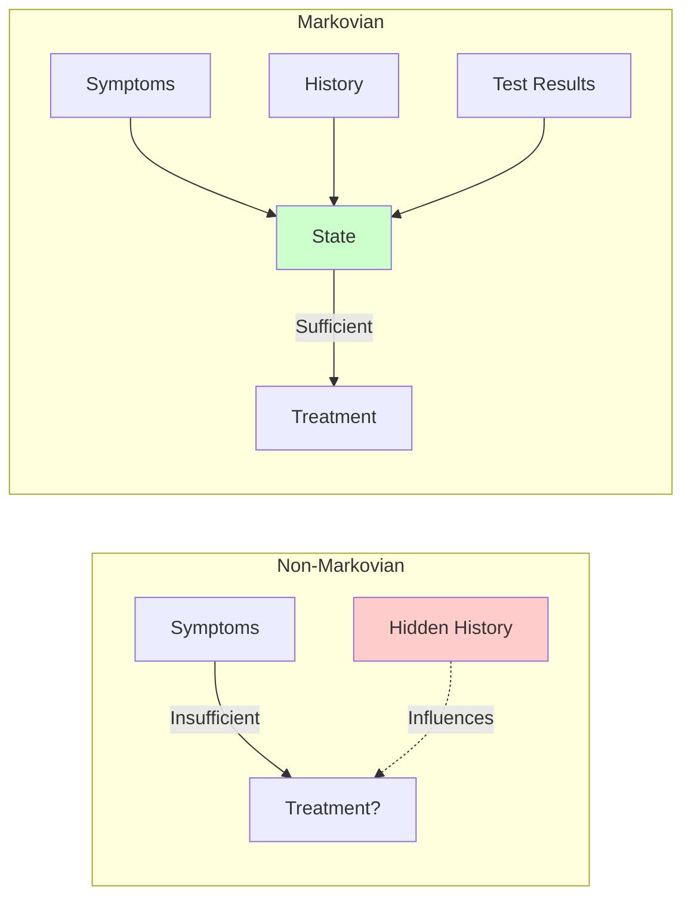
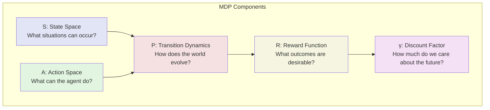
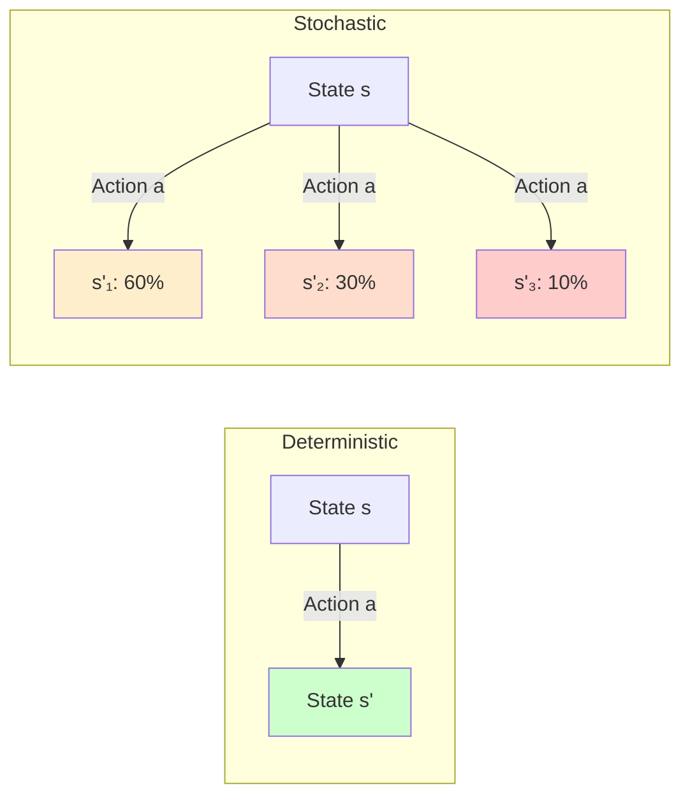
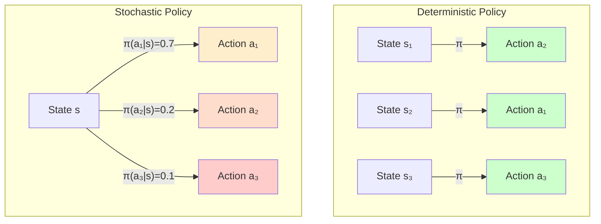
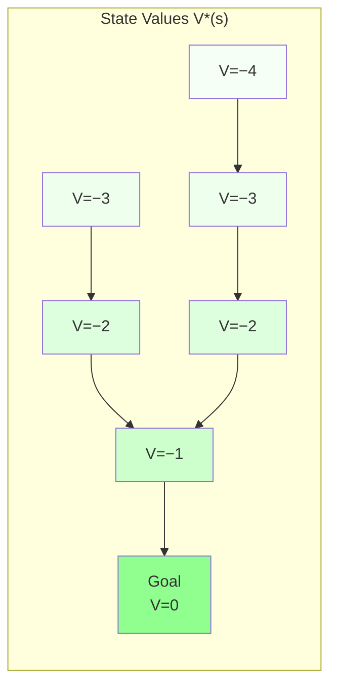
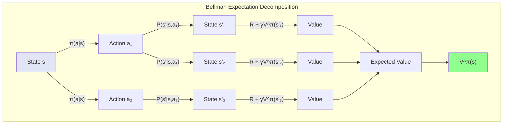

# Chapter 2: Markov Decision Processes

## The Markov Assumption

In 1906, Russian mathematician Andrey Markov was studying letter sequences in Russian literature when he made a profound observation: the probability of the next letter often depended only on the current letter, not the entire sequence that came before. This seemingly simple insight—that the future depends on the present but not the past—would become one of the most powerful abstractions in mathematics, physics, and computer science.

The Markov property states formally: "The future is independent of the past, given the present." In mathematical notation, for a stochastic process $\{X_t\}$:

$$ P(X_{t+1} | X_t, X_{t-1}, ..., X_0) = P(X_{t+1} | X_t) $$

This property might seem restrictive—surely many real-world processes depend on their history? The genius lies in how we define "the present." By choosing our state representation carefully, we can often transform history-dependent processes into Markovian ones.

### Why Markov?

Consider planning your route through a city. In principle, your next turn might depend on every street you've traversed, every traffic light you've encountered, the wear on your tires from previous trips, the phases of the moon when you learned to drive. Without the Markov assumption, optimal decision-making would require considering this entire history, making computation intractable.

The Markov assumption cuts through this complexity with surgical precision. If your current state (location, time, traffic conditions) contains all relevant information, then optimal decisions need only consider this state—not how you arrived there. This transforms an unbounded historical analysis into a tractable state-based computation.

### Engineering Markovian States

The art of applying MDPs lies in state design. Consider these examples:

**Non-Markovian**: A patient's current symptoms alone don't determine optimal treatment—their medical history matters.

**Made Markovian**: Include relevant history in the state: current symptoms + previous diagnoses + medication history + test results. Now the augmented state contains sufficient information for medical decisions.

**Non-Markovian**: A stock's current price alone doesn't determine optimal trading actions—momentum and trends matter.

**Made Markovian**: Include price history, moving averages, volume indicators, and market conditions in the state representation.

This state engineering transforms the Markov property from a limitation into a design principle. By thoughtfully choosing what information to include in our state, we can model surprisingly complex processes while maintaining computational tractability.

### Connection to Causality

The Markov property embodies a fundamental principle of causality: the present screens off the past from the future. This isn't just mathematical convenience—it reflects how physical processes actually unfold. The current configuration of particles determines their future evolution; the universe doesn't "remember" previous configurations except through their effect on the present.

This connection explains why MDPs work so well for physical systems, from robotics to molecular dynamics. When our state representation aligns with the system's true causal structure, the Markov property naturally holds.

## Defining the MDP: States, Actions, Transition Probabilities, Rewards, Discount Factor (γ)

A Markov Decision Process provides the mathematical scaffolding for sequential decision-making under uncertainty. Like a blueprint that specifies every beam and joint in a building, an MDP precisely defines every component needed to formulate and solve a reinforcement learning problem.

### The Quintuple: $(S, A, P, R, \gamma)$

An MDP consists of five components that together completely specify a sequential decision problem:

Let's dissect each component with the attention to detail it deserves.

### States $S$: The Information Foundation

The state space $S$ defines all possible configurations of the world relevant to decision-making. States can be:

**Discrete and Finite**: Chess positions, grid cells, health status ∈ {healthy, sick, critical}

**Discrete and Infinite**: Natural numbers representing inventory levels, unbounded queues

**Continuous**: Robot joint angles, vehicle positions, temperature readings

**Hybrid**: Autonomous driving with continuous positions and discrete traffic light states

The choice of state representation profoundly impacts everything that follows. Too coarse, and we lose crucial information. Too fine, and we face computational intractability. Consider temperature control:

- **Coarse**: {cold, comfortable, hot} - Simple but might oscillate
- **Fine**: Exact temperature to 0.001°C - Precise but possibly unnecessary
- **Thoughtful**: Temperature rounded to 0.5°C + rate of change - Balances precision with tractability

### Actions $A$: The Agent's Vocabulary

The action space $A$ defines what the agent can do in each state. Like states, actions can be:

**Discrete**: {up, down, left, right}, {buy, sell, hold}, {accept, reject}

**Continuous**: Torque values ∈ [-1, 1], steering angles ∈ [-30°, 30°]

**Parameterized**: Discrete action types with continuous parameters, like "move(x, y)" or "speak(text)"

The action space embodies the agent's interface with the world. In robotics, it might represent motor commands. In dialogue systems, it could be response templates. In financial trading, it encompasses order types and sizes.

A subtle but crucial point: the action space should include only what the agent directly controls. Environmental randomness belongs in the transition dynamics, not the action space.

### Transition Dynamics $P$: The World's Response

The transition probability function $P: S \times A \times S \rightarrow [0, 1]$ captures how the world evolves:

$$ P(s' | s, a) = \Pr(S_{t+1} = s' | S_t = s, A_t = a) $$

This function embodies all environmental uncertainty. When you take action $a$ in state $s$, $P$ defines the probability distribution over next states. Several special cases merit attention:

**Deterministic Dynamics**: $P(s' | s, a) \in \{0, 1\}$ for all transitions. Common in games and puzzles.

**Stochastic Dynamics**: True probabilities reflecting environmental uncertainty. Essential for robotics, finance, and real-world systems.

**Unknown Dynamics**: In model-free RL, we don't know $P$ and must learn from experience.

### Rewards $R$: The Objective Function

The reward function $R: S \times A \times S \rightarrow R$ defines what we want the agent to achieve:

$$ R(s, a, s') = \text{immediate reward for transition } s \xrightarrow{a} s' $$

Rewards encode objectives but require careful design:

**Sparse Rewards**: +1 for reaching goal, 0 elsewhere. Simple but hard to learn from.

**Dense Rewards**: Continuous feedback like negative distance to goal. More informative but may introduce unintended biases.

**Shaped Rewards**: Carefully designed to guide learning without changing optimal policy.

Common reward formulations:
- $R(s, a)$: Depends on state and action only
- $R(s)$: Depends on state only (reaching good states)
- $R(s, a, s')$: Full dependency (most general)

### Discount Factor $\gamma$: The Time Preference

The discount factor $\gamma \in [0, 1]$ determines how much we value future rewards relative to immediate ones:

- $\gamma = 0$: Myopic agent caring only about immediate reward
- $\gamma \rightarrow 1$: Far-sighted agent valuing future equally
- $\gamma = 0.9$: Common choice balancing both concerns

The discount factor serves multiple purposes:

1. **Mathematical Convergence**: Ensures infinite sums converge
2. **Economic Interpretation**: Models time preference and uncertainty
3. **Computational Stability**: Prevents values from growing unbounded

The effective horizon $H_{eff} \approx \frac{1}{1-\gamma}$ indicates how far into the future the agent effectively considers. With $\gamma = 0.99$, the agent looks roughly 100 steps ahead.

### A Complete Example: The Inventory Management MDP

Let's solidify these concepts with a concrete example:

**States**: $S = \{0, 1, 2, ..., M\}$ representing inventory levels

**Actions**: $A = \{0, 1, 2, ..., K\}$ representing order quantities

**Transitions**: 
$$ P(s' | s, a) = \begin{cases}
\Pr(\text{demand} = s + a - s') & \text{if } s' \leq s + a \\
0 & \text{otherwise}
\end{cases} $$

**Rewards**: $R(s, a, s') = \text{revenue} - \text{holding costs} - \text{order costs} - \text{stockout penalty}$

**Discount**: $\gamma = 0.95$ (reflecting quarterly planning horizon)

This MDP captures the essential trade-offs: ordering too much incurs holding costs, too little risks stockouts, and demand uncertainty drives the stochastic transitions.

## Policies (π) and Value Functions (V, Q): Quantifying "Goodness"

With the MDP framework established, we turn to the central objects of reinforcement learning: policies that prescribe behavior and value functions that evaluate it. These concepts transform the informal notion of "good decisions" into precise mathematical objects we can compute and optimize.

### Policies: From Intuition to Mathematics

A policy $\pi$ represents a complete behavioral strategy—a recipe telling the agent what to do in any situation. Formally, a policy is a mapping from states to actions (or action probabilities):

**Deterministic Policy**: $\pi: S \rightarrow A$
- In state $s$, always take action $\pi(s)$
- Example: "In chess position X, always play move Y"

**Stochastic Policy**: $\pi: S \times A \rightarrow [0, 1]$ where $\pi(a|s) = \Pr(A_t = a | S_t = s)$
- In state $s$, take action $a$ with probability $\pi(a|s)$
- Example: "In poker hand X, raise 70%, call 30%"

Why allow stochastic policies? Three compelling reasons:

1. **Exploration**: Randomness enables discovering new strategies
2. **Game Theory**: In competitive settings, predictability is exploitable
3. **Function Approximation**: Neural networks naturally output probabilities

### The State Value Function: Long-Term Prospects

The state value function $V^\pi(s)$ answers: "Starting from state $s$ and following policy $\pi$, what's my expected total reward?"

$$
V^\pi(s) = E_{\pi} \left[ \sum_{t=0}^{\infty} \gamma^t R_{t} \mid S_0 = s \right]
$$

This expectation accounts for:
- Randomness in the policy (if stochastic)
- Randomness in the environment transitions
- Discounting of future rewards

The value function transforms immediate perceptions into long-term evaluations. A chess position might look peaceful (good immediate features) but have low value (leads to inevitable checkmate).

### The Action Value Function: Decision-Time Evaluation

The action value function $Q^\pi(s, a)$ refines our evaluation: "Starting from state $s$, taking action $a$, then following policy $\pi$, what's my expected total reward?"

$$
Q^\pi(s, a) = E_{\pi} \left[ \sum_{t=0}^{\infty} \gamma^t R_{t} \mid S_0 = s, A_0 = a \right]
$$

The Q-function directly supports decision-making. To act optimally, choose $\arg\max_a Q^*(s, a)$ where $Q^*$ is the optimal action-value function.

The relationship between V and Q is fundamental:

$$ V^\pi(s) = \sum_a \pi(a|s) Q^\pi(s, a) $$

For deterministic policies: $V^\pi(s) = Q^\pi(s, \pi(s))$

### Optimal Policies and Value Functions

Among all possible policies, some achieve the highest possible value in every state. These optimal policies (possibly non-unique) share the same optimal value functions:

$$ V^*(s) = \max_\pi V^\pi(s) \quad \forall s \in S $$
$$ Q^*(s, a) = \max_\pi Q^\pi(s, a) \quad \forall s \in S, a \in A $$

A remarkable property: any policy that acts greedily with respect to $Q^*$ is optimal:

$$\pi^*(s) \in \arg\max_a Q^*(s, a) $$

This reduces the problem of finding optimal behavior to computing optimal values—a profound simplification that underlies many RL algorithms.

### Visualization: The Landscape of Values

Consider a simple gridworld where an agent navigates to a goal:

The value function creates a "landscape" where optimal actions follow the gradient toward higher values—a geometric interpretation that guides both intuition and algorithms.

## Deriving the Bellman Expectation Equation from First Principles

The Bellman equations stand as the cornerstone of reinforcement learning, providing recursive relationships that connect values across time. Their derivation from first principles reveals deep insights about sequential decision-making and optimal behavior.

### The Recursive Nature of Value

Start with the definition of the state value function:

$$
V^\pi(s) = E_{\pi} \left[ \sum_{t=0}^{\infty} \gamma^t R_{t} \mid S_0 = s \right]
$$

The key insight: we can separate the immediate reward from future rewards:

$$
V^\pi(s) = E_{\pi} \left[ R_0 + \sum_{t=1}^{\infty} \gamma^t R_{t} \mid S_0 = s \right]
$$

Factor out $\gamma$ from the future sum:

$$
V^\pi(s) = E_{\pi} \left[ R_0 + \gamma \sum_{t=1}^{\infty} \gamma^{t-1} R_{t} \mid S_0 = s \right]
$$

Now the crucial observation: the future sum is just the value function starting from $S_1$:

$$
V^\pi(s) = E_{\pi} \left[ R_0 + \gamma V^\pi(S_1) \mid S_0 = s \right]
$$

### Expanding the Expectation

To make this concrete, we expand over actions and next states:

$$ V^\pi(s) = \sum_a \pi(a|s) \sum_{s'} P(s'|s,a) \left[ R(s,a,s') + \gamma V^\pi(s') \right] $$

This is the **Bellman Expectation Equation** for $V^\pi$. It states that the value of a state equals the expected immediate reward plus the discounted value of the next state, averaging over the policy's action choices and environmental transitions.

### The Bellman Equation for Q

Similarly, for the action-value function:

$$ Q^\pi(s, a) = \sum_{s'} P(s'|s,a) \left[ R(s,a,s') + \gamma \sum_{a'} \pi(a'|s') Q^\pi(s', a') \right] $$

Or more compactly using the V-Q relationship:

$$ Q^\pi(s, a) = \sum_{s'} P(s'|s,a) \left[ R(s,a,s') + \gamma V^\pi(s') \right] $$

### The Bellman Optimality Equations

For optimal value functions, we replace the policy's expectations with maximization:

$$ V^*(s) = \max_a \sum_{s'} P(s'|s,a) \left[ R(s,a,s') + \gamma V^*(s') \right] $$

$$ Q^*(s, a) = \sum_{s'} P(s'|s,a) \left[ R(s,a,s') + \gamma \max_{a'} Q^*(s', a') \right] $$

These equations characterize optimal behavior: at each state, choose the action that maximizes expected immediate reward plus discounted future value.

### The Contraction Mapping Perspective

The Bellman equations can be viewed as fixed-point equations. Define the Bellman operator $\mathcal{T}^\pi$ acting on value functions:

$$(\mathcal{T}^\pi V)(s) = \sum_a \pi(a|s) \sum_{s'} P(s'|s,a) \left[ R(s,a,s') + \gamma V(s') \right] $$

Then $V^\pi$ is the unique fixed point: $\mathcal{T}^\pi V^\pi = V^\pi$

This operator is a contraction mapping (for $\gamma < 1$):

$$||\mathcal{T}^\pi V - \mathcal{T}^\pi U||_\infty \leq \gamma ||V - U||_\infty $$

By the Banach fixed-point theorem, iteratively applying $\mathcal{T}^\pi$ converges to $V^\pi$ from any starting point—the mathematical foundation for value iteration and policy evaluation algorithms.

### Computational Implications

The Bellman equations transform the problem of evaluating policies from solving integral equations to solving systems of linear equations (for finite MDPs):

For each state $s$:
$$ V^\pi(s) = \sum_a \pi(a|s) \sum_{s'} P(s'|s,a) \left[ R(s,a,s') + \gamma V^\pi(s') \right] $$

This gives us $|S|$ equations with $|S|$ unknowns—solvable through:
- Direct methods: Matrix inversion (for small state spaces)
- Iterative methods: Value iteration, policy evaluation
- Approximate methods: Function approximation for large/continuous spaces

### Philosophy

The Bellman equations encode a profound principle: optimal behavior requires consistency between immediate decisions and future consequences. They formalize the intuition that good decisions now should lead to situations where good decisions remain available.

This recursive optimality appears throughout mathematics and nature:
- **Dynamic Programming**: Optimal substructure in algorithms
- **Physics**: Principle of least action and Hamilton-Jacobi equations  
- **Economics**: Euler equations in optimal control
- **Biology**: Optimal foraging and evolutionary strategies

The universality of these recursive relationships suggests that the Bellman equations capture something fundamental about rational decision-making in temporal domains.

### From Theory to Algorithm

The Bellman equations directly inspire the core algorithms of reinforcement learning:

1. **Policy Evaluation**: Solve $\mathcal{T}^\pi V = V$ to find $V^\pi$
2. **Policy Improvement**: Use $V^\pi$ to find a better policy
3. **Value Iteration**: Solve $\mathcal{T}^* V = V$ to find $V^*$ directly
4. **Q-Learning**: Learn $Q^*$ through samples without a model

Each algorithm exploits the recursive structure exposed by Bellman's insight, turning abstract optimality conditions into concrete computational procedures.

The journey from Markov's observation about letter sequences to the Bellman equations spans probability theory, dynamic programming, and optimal control. These equations don't just describe optimal behavior—they provide a computational path to discovering it. As we proceed through this book, we'll see these fundamental relationships appear again and again, each time revealing new facets of the reinforcement learning gem.