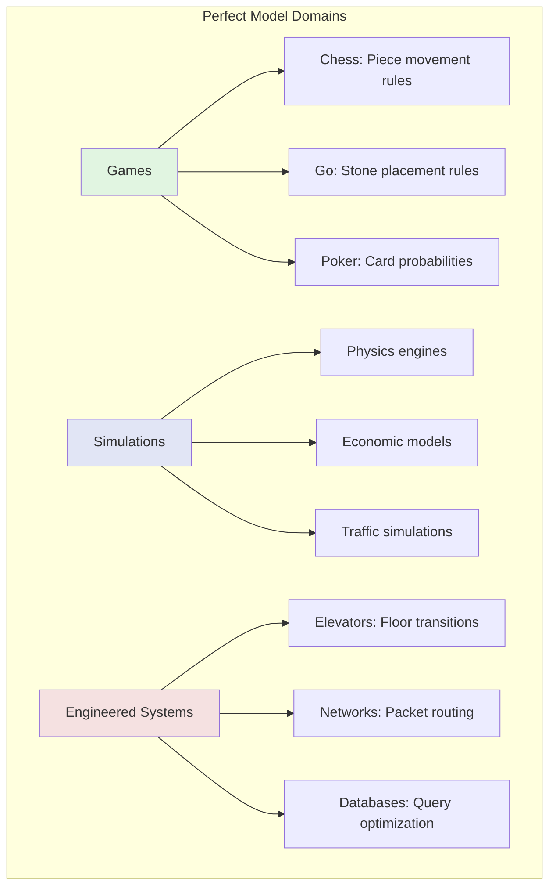
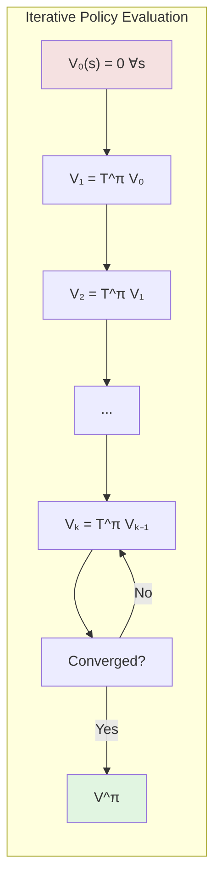
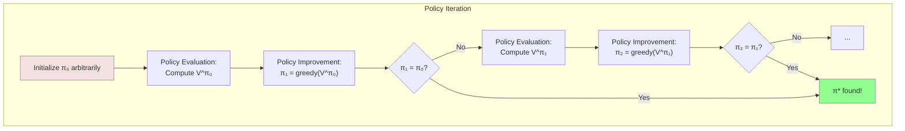
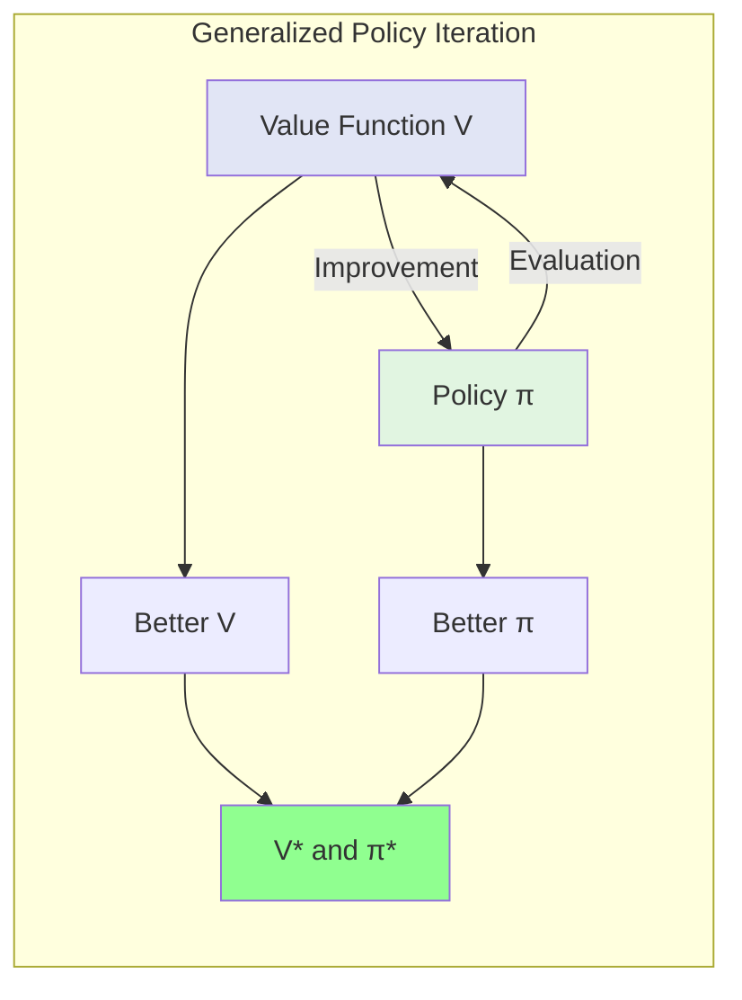
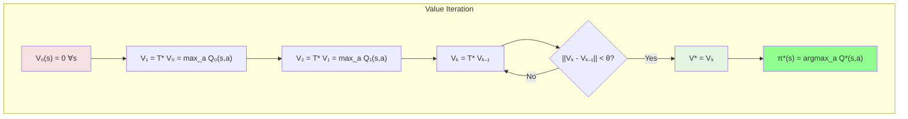

# Chapter 3: Planning with a Perfect Model: Dynamic Programming

## The Pre-requisite: A Perfect Model of the World

Dynamic Programming (DP) in reinforcement learning begins with a bold assumption: we know exactly how the world works. We possess the transition probabilities $P(s'|s,a)$ and reward function $R(s,a,s')$ that govern our environment. This might seem like cheating—after all, if we know everything about the environment, why do we need learning? The answer reveals the fundamental distinction between planning and learning, and why mastering DP provides the conceptual foundation for all of reinforcement learning.

Consider a master chess player analyzing a position. They know the rules perfectly—how each piece moves, what constitutes checkmate, the objective of the game. Yet knowing the rules doesn't immediately reveal the best move. The challenge lies in reasoning through the astronomical number of possible future game states to find optimal play. This is planning: leveraging a known model to compute optimal behavior.

Dynamic Programming transforms this planning problem into a computational procedure. The term itself, coined by Richard Bellman in the 1950s to make his research sound impressive to government funding agencies, captures two key ideas:
- **Dynamic**: The problem involves sequences of decisions over time
- **Programming**: We seek a systematic computational method (not programming in the modern sense)

### When Do We Have Perfect Models?

Perfect models arise more often than you might expect:

**Games and Puzzles**: Chess, Go, Sudoku—the rules completely define the dynamics


**Engineered Systems**: Elevators, network routers, database query optimizers—we designed them, so we know their dynamics

**Simplified Models**: Often, we create approximate models that are "perfect" within their assumptions, like grid-world approximations of robot navigation

**Sub-problems**: Even in model-free settings, we might learn a model and then plan with it, making DP relevant for model-based RL

### The Computational Challenge

Having a perfect model doesn't make the problem trivial. Consider the game of Go:
- State space: ~$10^{170}$ possible positions
- Action space: Up to 361 possible moves
- Horizon: Games last ~150 moves

Even with perfect knowledge of the rules, brute-force planning is impossible. Dynamic Programming provides a principled way to exploit the problem's structure, turning intractable enumeration into feasible computation.

### The Promise and Limitations

DP algorithms offer strong guarantees:
- **Convergence**: They provably find optimal policies
- **Efficiency**: They exploit problem structure to avoid redundant computation
- **Foundation**: They inspire model-free algorithms that work without perfect models

But they also face limitations:
- **State Space Size**: Computation scales with the number of states
- **Model Accuracy**: Performance degrades if the model is wrong
- **Computational Resources**: Memory and time requirements can be prohibitive

Understanding these trade-offs helps us appreciate why the field developed model-free methods, and why modern approaches often combine model-based and model-free techniques.

## Policy Evaluation and Policy Iteration: The Dance of Prediction and Control

Policy Iteration embodies a fundamental insight: we can decompose the problem of finding optimal behavior into two simpler sub-problems that, when alternated, converge to optimality. This decomposition—between evaluating policies and improving them—appears throughout reinforcement learning and optimization more broadly.

### Policy Evaluation: Prediction Given a Policy

Given a policy $\pi$, policy evaluation computes its value function $V^\pi$. This answers the prediction question: "If I follow this policy, how well will I do from each state?"

The Bellman expectation equation provides the key:
$$V^\pi(s) = \sum_a \pi(a|s) \sum_{s'} P(s'|s,a) [R(s,a,s') + \gamma V^\pi(s')]$$

This is a system of linear equations—one per state. For small state spaces, we can solve directly:

$$V^\pi = (I - \gamma P^\pi)^{-1} R^\pi$$

Where $P^\pi$ is the transition matrix under policy $\pi$ and $R^\pi$ is the expected immediate reward vector.

But matrix inversion is $O(|S|^3)$, impractical for large state spaces. Instead, we use iterative policy evaluation:



**Algorithm: Iterative Policy Evaluation**
```python
def policy_evaluation(env, policy, gamma=0.99, theta=1e-6):
    V = np.zeros(env.nS)  # Initialize value function
    
    while True:
        delta = 0
        for s in range(env.nS):
            v = V[s]
            # Update V(s) using Bellman expectation
            V[s] = sum(policy[s][a] * 
                      sum(p * (r + gamma * V[s_])
                          for p, s_, r, _ in env.P[s][a])
                      for a in range(env.nA))
            delta = max(delta, abs(v - V[s]))
        
        if delta < theta:
            break
    
    return V
```

The algorithm repeatedly applies the Bellman operator until convergence. Each iteration is $O(|S|^2|A|)$, and convergence is guaranteed for $\gamma < 1$.

### Policy Improvement: Control Given Values

Given value function $V^\pi$, can we find a better policy? The policy improvement theorem provides a constructive answer.

Define the improved policy $\pi'$ as:
$$\pi'(s) = \arg\max_a \sum_{s'} P(s'|s,a)[R(s,a,s') + \gamma V^\pi(s')]$$

This greedy policy chooses actions that maximize expected value according to $V^\pi$. The remarkable result: $\pi'$ is guaranteed to be at least as good as $\pi$, and strictly better unless $\pi$ is already optimal.

**Proof Sketch**: For any state $s$:
$$Q^\pi(s, \pi'(s)) = \max_a Q^\pi(s, a) \geq Q^\pi(s, \pi(s)) = V^\pi(s)$$

This inequality propagates through the Bellman equations to show $V^{\pi'} \geq V^\pi$ everywhere.

### The Policy Iteration Algorithm

Combining evaluation and improvement yields Policy Iteration:



**Algorithm: Policy Iteration**
```python
def policy_iteration(env, gamma=0.99):
    # Initialize with random policy
    policy = np.ones([env.nS, env.nA]) / env.nA
    
    while True:
        # Policy Evaluation
        V = policy_evaluation(env, policy, gamma)
        
        # Policy Improvement
        policy_stable = True
        
        for s in range(env.nS):
            old_action = np.argmax(policy[s])
            
            # Compute Q-values for all actions
            Q_values = np.zeros(env.nA)
            for a in range(env.nA):
                Q_values[a] = sum(p * (r + gamma * V[s_])
                                  for p, s_, r, _ in env.P[s][a])
            
            # Update policy to be greedy
            best_action = np.argmax(Q_values)
            policy[s] = np.eye(env.nA)[best_action]
            
            if old_action != best_action:
                policy_stable = False
        
        if policy_stable:
            return policy, V
```

### Convergence Analysis

Policy Iteration enjoys strong theoretical guarantees:

1. **Monotonic Improvement**: Each iteration produces a policy at least as good as the previous
2. **Finite Convergence**: For finite MDPs, reaches optimal policy in finite iterations
3. **Worst-case Bound**: At most $|A|^{|S|}$ iterations (number of deterministic policies)

In practice, convergence is much faster—often just 3-5 iterations for many problems. This surprising efficiency makes Policy Iteration practical for moderate-sized MDPs.

### Generalized Policy Iteration

The evaluation-improvement cycle extends beyond the specific algorithm above. Generalized Policy Iteration (GPI) describes any process that maintains approximate value functions and policies, improving each using the other:



This GPI perspective unifies many RL algorithms:
- **Value Iteration**: Truncated evaluation (one step) before improvement
- **Asynchronous DP**: Update states in any order
- **Monte Carlo**: Evaluate using samples instead of model
- **Temporal Difference**: Bootstrap from current estimates

The dance between evaluation and improvement, between prediction and control, represents a fundamental pattern in reinforcement learning that we'll encounter repeatedly throughout this book.

## Value Iteration: The Direct Path to Optimality

While Policy Iteration elegantly separates evaluation from improvement, Value Iteration takes a more direct approach: why not compute optimal values directly? This insight leads to a simpler algorithm that often performs better in practice.

### The Bellman Optimality Operator

Value Iteration builds on the Bellman optimality equation:
$$V^*(s) = \max_a \sum_{s'} P(s'|s,a)[R(s,a,s') + \gamma V^*(s')]$$

Define the Bellman optimality operator $\mathcal{T}^*$:
$$(\mathcal{T}^* V)(s) = \max_a \sum_{s'} P(s'|s,a)[R(s,a,s') + \gamma V(s')]$$

The optimal value function is the fixed point: $\mathcal{T}^* V^* = V^*$

Like the policy evaluation operator, $\mathcal{T}^*$ is a contraction mapping, guaranteeing convergence from any starting point.

### The Algorithm

Value Iteration repeatedly applies $\mathcal{T}^*$ until convergence:



**Algorithm: Value Iteration**
```python
def value_iteration(env, gamma=0.99, theta=1e-6):
    V = np.zeros(env.nS)
    
    while True:
        delta = 0
        for s in range(env.nS):
            v = V[s]
            # Update V(s) using Bellman optimality
            V[s] = max(sum(p * (r + gamma * V[s_])
                           for p, s_, r, _ in env.P[s][a])
                       for a in range(env.nA))
            delta = max(delta, abs(v - V[s]))
        
        if delta < theta:
            break
    
    # Extract optimal policy
    policy = np.zeros([env.nS, env.nA])
    for s in range(env.nS):
        Q_values = np.array([sum(p * (r + gamma * V[s_])
                                 for p, s_, r, _ in env.P[s][a])
                             for a in range(env.nA)])
        best_action = np.argmax(Q_values)
        policy[s, best_action] = 1.0
    
    return policy, V
```

### Comparing Policy and Value Iteration

The relationship between these algorithms is subtle:

**Policy Iteration**: 
- Full policy evaluation between improvements
- Fewer iterations to converge
- Each iteration more expensive
- Memory for both policy and values

**Value Iteration**:
- One-step evaluation between improvements  
- More iterations to converge
- Each iteration cheaper
- Memory only for values

In fact, Value Iteration is Policy Iteration with evaluation truncated to one step. This connection becomes clear through Modified Policy Iteration, which evaluates for $k$ steps:
- $k = 1$: Value Iteration
- $k = \infty$: Policy Iteration
- $1 < k < \infty$: Intermediate algorithms

### Asynchronous Dynamic Programming

Both algorithms update all states in each iteration—inefficient if only some states matter. Asynchronous DP updates states in any order:

**In-Place Updates**: Use new values immediately
```python
for s in states:
    V[s] = max(...)  # Uses updated V[s'] values
```

**Prioritized Sweeping**: Update states with large Bellman errors first
```python
while priority_queue:
    s = priority_queue.pop_max_error()
    old_v = V[s]
    V[s] = max(...)
    error = abs(V[s] - old_v)
    # Add predecessors to queue if error is large
```

**Real-Time DP**: Update only visited states during actual/simulated trajectories

These variants dramatically improve efficiency for large state spaces where only a fraction of states are relevant.

### Convergence and Stopping Criteria

Value Iteration converges geometrically with rate $\gamma$:
$$||V_{k+1} - V^*||_\infty \leq \gamma ||V_k - V^*||_\infty$$

This provides practical stopping criteria:

1. **Value Change**: Stop when $||V_{k+1} - V_k||_\infty < \theta$
2. **Bellman Error**: Stop when $||V - \mathcal{T}^* V||_\infty < \theta$  
3. **Policy Stability**: Stop when greedy policy stops changing

The relationship between value error and policy quality:
$$||V - V^*||_\infty < \epsilon \implies V^{\pi_\text{greedy}} \geq V^* - \frac{2\epsilon\gamma}{1-\gamma}$$

This bound helps choose stopping thresholds based on desired policy quality.

## Code Project: Gridworld Solver with Value Iteration

Let's solidify our understanding by implementing a complete gridworld solver. This implementation showcases practical considerations often glossed over in theoretical presentations.

### The Gridworld Environment

First, we'll create a flexible gridworld environment:

```python
import numpy as np
import matplotlib.pyplot as plt
from matplotlib.patches import Rectangle, FancyBboxPatch
import matplotlib.patches as mpatches

class GridWorld:
    """
    A customizable gridworld environment for Dynamic Programming experiments.
    
    Features:
    - Configurable grid size and layout
    - Obstacles, rewards, and terminal states
    - Stochastic transitions (wind, slippery surfaces)
    - Rich visualization capabilities
    """
    
    def __init__(self, height=4, width=4, start=(0, 0), terminals=None, 
                 obstacles=None, rewards=None, wind=None, slip_prob=0.0):
        self.height = height
        self.width = width
        self.start = start
        self.terminals = terminals or [(height-1, width-1)]
        self.obstacles = obstacles or []
        self.rewards = rewards or {}
        self.wind = wind or {}
        self.slip_prob = slip_prob
        
        # Define action space
        self.actions = {
            0: (-1, 0),  # UP
            1: (0, 1),   # RIGHT
            2: (1, 0),   # DOWN
            3: (0, -1)   # LEFT
        }
        self.action_names = ['↑', '→', '↓', '←']
        
        # Create state space
        self.states = []
        self.state_to_idx = {}
        idx = 0
        for i in range(height):
            for j in range(width):
                if (i, j) not in self.obstacles:
                    self.states.append((i, j))
                    self.state_to_idx[(i, j)] = idx
                    idx += 1
        
        self.nS = len(self.states)
        self.nA = len(self.actions)
        
        # Build transition and reward models
        self.P = self._build_transitions()
        
    def _build_transitions(self):
        """Build transition probability matrix P[s][a] = [(prob, next_state, reward, done), ...]"""
        P = {}
        
        for idx, state in enumerate(self.states):
            P[idx] = {}
            
            for action in range(self.nA):
                transitions = []
                
                if state in self.terminals:
                    # Terminal states self-loop
                    transitions.append((1.0, idx, 0.0, True))
                else:
                    # Calculate intended next state
                    intended_next = self._get_next_state(state, action)
                    
                    # Handle stochasticity
                    if self.slip_prob > 0:
                        # With slip_prob, go perpendicular to intended direction
                        for a in range(self.nA):
                            next_state = self._get_next_state(state, a)
                            next_idx = self.state_to_idx.get(next_state, idx)
                            
                            if a == action:
                                prob = 1 - self.slip_prob
                            elif (a - action) % 4 in [1, 3]:  # Perpendicular
                                prob = self.slip_prob / 2
                            else:
                                prob = 0
                            
                            if prob > 0:
                                reward = self._get_reward(state, a, next_state)
                                done = next_state in self.terminals
                                transitions.append((prob, next_idx, reward, done))
                    else:
                        # Deterministic transition
                        next_idx = self.state_to_idx.get(intended_next, idx)
                        reward = self._get_reward(state, action, intended_next)
                        done = intended_next in self.terminals
                        transitions.append((1.0, next_idx, reward, done))
                
                P[idx][action] = transitions
        
        return P
    
    def _get_next_state(self, state, action):
        """Get next state given current state and action, considering wind."""
        row, col = state
        drow, dcol = self.actions[action]
        
        # Apply action
        next_row = row + drow
        next_col = col + dcol
        
        # Apply wind if present
        if state in self.wind:
            wind_row, wind_col = self.wind[state]
            next_row += wind_row
            next_col += wind_col
        
        # Check boundaries and obstacles
        if (0 <= next_row < self.height and 
            0 <= next_col < self.width and
            (next_row, next_col) not in self.obstacles):
            return (next_row, next_col)
        else:
            return state  # Stay in place if hit wall/obstacle
    
    def _get_reward(self, state, action, next_state):
        """Get reward for transition."""
        # Check for special rewards
        if next_state in self.rewards:
            return self.rewards[next_state]
        elif next_state in self.terminals:
            return 0.0  # Default terminal reward
        else:
            return -1.0  # Default step cost
    
    def render_values(self, V, title="State Values"):
        """Visualize value function."""
        fig, ax = plt.subplots(figsize=(8, 8))
        
        # Create value grid
        value_grid = np.full((self.height, self.width), np.nan)
        for idx, state in enumerate(self.states):
            value_grid[state] = V[idx]
        
        # Plot heatmap
        masked_grid = np.ma.masked_invalid(value_grid)
        im = ax.imshow(masked_grid, cmap='RdYlGn', aspect='equal', 
                       vmin=np.min(V), vmax=np.max(V))
        
        # Add colorbar
        plt.colorbar(im, ax=ax, fraction=0.046, pad=0.04)
        
        # Draw grid and annotations
        for i in range(self.height):
            for j in range(self.width):
                if (i, j) in self.obstacles:
                    ax.add_patch(Rectangle((j-0.5, i-0.5), 1, 1, 
                                         facecolor='black'))
                elif (i, j) in self.states:
                    idx = self.state_to_idx[(i, j)]
                    ax.text(j, i, f'{V[idx]:.2f}', ha='center', va='center',
                           fontsize=12, fontweight='bold')
                    
                    if (i, j) in self.terminals:
                        ax.add_patch(Rectangle((j-0.5, i-0.5), 1, 1, 
                                             facecolor='none', 
                                             edgecolor='gold', linewidth=3))
                    
                    if (i, j) == self.start:
                        ax.add_patch(plt.Circle((j, i), 0.3, 
                                              facecolor='none', 
                                              edgecolor='blue', linewidth=3))
        
        # Add rewards
        for state, reward in self.rewards.items():
            if reward != -1:
                i, j = state
                ax.text(j, i-0.35, f'R={reward}', ha='center', va='center',
                       fontsize=10, style='italic', color='darkred')
        
        ax.set_xlim(-0.5, self.width - 0.5)
        ax.set_ylim(self.height - 0.5, -0.5)
        ax.set_xticks(range(self.width))
        ax.set_yticks(range(self.height))
        ax.grid(True, linewidth=2, color='black')
        ax.set_title(title, fontsize=16, fontweight='bold')
        
        plt.tight_layout()
        return fig, ax
    
    def render_policy(self, policy, V=None, title="Optimal Policy"):
        """Visualize policy with optional value backdrop."""
        fig, ax = plt.subplots(figsize=(8, 8))
        
        # Plot value heatmap if provided
        if V is not None:
            value_grid = np.full((self.height, self.width), np.nan)
            for idx, state in enumerate(self.states):
                value_grid[state] = V[idx]
            masked_grid = np.ma.masked_invalid(value_grid)
            ax.imshow(masked_grid, cmap='RdYlGn', aspect='equal', 
                     alpha=0.3, vmin=np.min(V), vmax=np.max(V))
        
        # Draw grid and policy arrows
        for i in range(self.height):
            for j in range(self.width):
                if (i, j) in self.obstacles:
                    ax.add_patch(Rectangle((j-0.5, i-0.5), 1, 1, 
                                         facecolor='black'))
                elif (i, j) in self.states:
                    idx = self.state_to_idx[(i, j)]
                    
                    if (i, j) not in self.terminals:
                        # Get action from policy
                        if policy.ndim == 2:  # Stochastic policy
                            action = np.argmax(policy[idx])
                        else:  # Deterministic policy
                            action = policy[idx]
                        
                        # Draw arrow
                        di, dj = self.actions[action]
                        ax.arrow(j, i, dj*0.3, di*0.3, 
                                head_width=0.15, head_length=0.1, 
                                fc='darkblue', ec='darkblue', linewidth=2)
                    
                    # Mark special states
                    if (i, j) in self.terminals:
                        ax.add_patch(FancyBboxPatch((j-0.4, i-0.4), 0.8, 0.8,
                                                   boxstyle="round,pad=0.1",
                                                   facecolor='gold', 
                                                   edgecolor='darkorange',
                                                   linewidth=2))
                        ax.text(j, i, 'GOAL', ha='center', va='center',
                               fontsize=10, fontweight='bold')
                    
                    if (i, j) == self.start:
                        ax.add_patch(plt.Circle((j, i), 0.35, 
                                              facecolor='lightblue', 
                                              edgecolor='darkblue', 
                                              linewidth=2, alpha=0.7))
                        ax.text(j, i, 'START', ha='center', va='center',
                               fontsize=8, fontweight='bold')
        
        ax.set_xlim(-0.5, self.width - 0.5)
        ax.set_ylim(self.height - 0.5, -0.5)
        ax.set_xticks(range(self.width))
        ax.set_yticks(range(self.height))
        ax.grid(True, linewidth=2, color='black')
        ax.set_title(title, fontsize=16, fontweight='bold')
        
        # Add legend
        legend_elements = [
            mpatches.Patch(color='gold', label='Goal'),
            mpatches.Patch(color='lightblue', label='Start'),
            mpatches.Patch(color='black', label='Obstacle')
        ]
        ax.legend(handles=legend_elements, loc='upper left', 
                 bbox_to_anchor=(1.05, 1), fontsize=12)
        
        plt.tight_layout()
        return fig, ax
```

### Building the Dynamic Programming Solver

Now that we have our environment, let's implement our DP algorithms. We'll create a comprehensive solver class that implements Policy Iteration, Value Iteration, and their variants. The key insight is that these algorithms share common structure—they all revolve around the Bellman equations.

```python
class DPSolver:
    """
    Dynamic Programming solver implementing multiple algorithms.
    
    This class demonstrates the relationships between different DP algorithms
    and provides detailed instrumentation for understanding their behavior.
    """
    
    def __init__(self, env, gamma=0.99):
        self.env = env
        self.gamma = gamma
        self.iteration_history = []
        
    def policy_evaluation(self, policy, theta=1e-6, max_iterations=1000):
        """
        Evaluate a given policy using iterative policy evaluation.
        
        This is the "prediction" problem: given π, compute V^π.
        """
        V = np.zeros(self.env.nS)
        iteration_count = 0
        
        for i in range(max_iterations):
            delta = 0
            v_old = V.copy()
            
            for s in range(self.env.nS):
                # Store old value for convergence check
                v = V[s]
                
                # Apply Bellman expectation equation
                # V^π(s) = Σ_a π(a|s) Σ_s' P(s'|s,a)[R + γV^π(s')]
                new_value = 0
                for a in range(self.env.nA):
                    # Probability of taking action a in state s under policy π
                    action_prob = policy[s, a] if policy.ndim == 2 else (1.0 if policy[s] == a else 0.0)
                    
                    # Expected value of taking action a
                    for prob, next_state, reward, done in self.env.P[s][a]:
                        new_value += action_prob * prob * (
                            reward + self.gamma * V[next_state] * (1 - done)
                        )
                
                V[s] = new_value
                delta = max(delta, abs(v - V[s]))
            
            iteration_count += 1
            
            # Track convergence
            self.iteration_history.append({
                'iteration': i,
                'delta': delta,
                'V': V.copy(),
                'mean_value': np.mean(V),
                'max_value': np.max(V),
                'min_value': np.min(V)
            })
            
            if delta < theta:
                break
        
        return V, iteration_count
    
    def policy_improvement(self, V):
        """
        Improve policy given value function.
        
        This is the "control" step: given V^π, find π' ≥ π.
        """
        policy = np.zeros((self.env.nS, self.env.nA))
        
        for s in range(self.env.nS):
            # Compute Q^π(s,a) for all actions
            Q_values = np.zeros(self.env.nA)
            
            for a in range(self.env.nA):
                for prob, next_state, reward, done in self.env.P[s][a]:
                    Q_values[a] += prob * (reward + self.gamma * V[next_state] * (1 - done))
            
            # Choose action that maximizes Q-value (breaking ties consistently)
            best_action = np.argmax(Q_values)
            policy[s, best_action] = 1.0
        
        return policy
    
    def policy_iteration(self, theta=1e-6):
        """
        Find optimal policy using Policy Iteration.
        
        Alternates between policy evaluation and policy improvement.
        """
        # Initialize with uniform random policy
        policy = np.ones((self.env.nS, self.env.nA)) / self.env.nA
        
        iteration = 0
        policy_stable = False
        
        while not policy_stable:
            # Policy Evaluation
            V, eval_iterations = self.policy_evaluation(policy, theta)
            
            # Policy Improvement
            new_policy = self.policy_improvement(V)
            
            # Check if policy has changed
            policy_stable = np.array_equal(policy, new_policy)
            policy = new_policy
            
            iteration += 1
            print(f"Policy Iteration {iteration}: Evaluation took {eval_iterations} iterations")
            
            if iteration > 100:  # Safety check
                print("Warning: Policy iteration did not converge in 100 iterations")
                break
        
        return policy, V, iteration
    
    def value_iteration(self, theta=1e-6, max_iterations=1000):
        """
        Find optimal policy using Value Iteration.
        
        Directly computes V* using Bellman optimality equation.
        """
        V = np.zeros(self.env.nS)
        iteration_count = 0
        
        for i in range(max_iterations):
            delta = 0
            
            for s in range(self.env.nS):
                v = V[s]
                
                # Apply Bellman optimality equation
                # V*(s) = max_a Σ_s' P(s'|s,a)[R + γV*(s')]
                Q_values = np.zeros(self.env.nA)
                
                for a in range(self.env.nA):
                    for prob, next_state, reward, done in self.env.P[s][a]:
                        Q_values[a] += prob * (reward + self.gamma * V[next_state] * (1 - done))
                
                V[s] = np.max(Q_values)
                delta = max(delta, abs(v - V[s]))
            
            iteration_count += 1
            
            # Track progress
            if i % 10 == 0:
                print(f"Value Iteration {i}: delta = {delta:.6f}")
            
            if delta < theta:
                break
        
        # Extract optimal policy from optimal values
        policy = self.policy_improvement(V)
        
        return policy, V, iteration_count
    
    def modified_policy_iteration(self, k=5, theta=1e-6):
        """
        Modified Policy Iteration: interpolates between VI (k=1) and PI (k=∞).
        
        Uses k steps of value iteration for policy evaluation.
        """
        policy = np.ones((self.env.nS, self.env.nA)) / self.env.nA
        V = np.zeros(self.env.nS)
        
        iteration = 0
        policy_stable = False
        
        while not policy_stable:
            # Partial Policy Evaluation (k steps of value iteration)
            for _ in range(k):
                for s in range(self.env.nS):
                    new_value = 0
                    for a in range(self.env.nA):
                        action_prob = policy[s, a]
                        for prob, next_state, reward, done in self.env.P[s][a]:
                            new_value += action_prob * prob * (
                                reward + self.gamma * V[next_state] * (1 - done)
                            )
                    V[s] = new_value
            
            # Policy Improvement
            new_policy = self.policy_improvement(V)
            
            # Check convergence
            policy_stable = np.array_equal(policy, new_policy)
            policy = new_policy
            
            iteration += 1
            
            if iteration > 100:
                break
        
        return policy, V, iteration
    
    def prioritized_sweeping_value_iteration(self, theta=1e-6, priority_theta=1e-5):
        """
        Value Iteration with prioritized sweeping.
        
        Updates states with largest Bellman error first, dramatically
        improving efficiency for large state spaces.
        """
        import heapq
        
        V = np.zeros(self.env.nS)
        
        # Priority queue stores (-priority, state) for max-heap behavior
        pq = []
        
        # Initialize priorities
        for s in range(self.env.nS):
            # Compute initial Bellman error
            Q_values = np.zeros(self.env.nA)
            for a in range(self.env.nA):
                for prob, next_state, reward, done in self.env.P[s][a]:
                    Q_values[a] += prob * (reward + self.gamma * V[next_state] * (1 - done))
            
            error = abs(np.max(Q_values) - V[s])
            if error > priority_theta:
                heapq.heappush(pq, (-error, s))
        
        # Track predecessors for each state
        predecessors = {s: set() for s in range(self.env.nS)}
        for s in range(self.env.nS):
            for a in range(self.env.nA):
                for prob, next_state, _, _ in self.env.P[s][a]:
                    if prob > 0 and next_state != s:
                        predecessors[next_state].add(s)
        
        iteration = 0
        while pq and iteration < 10000:
            # Pop state with highest priority
            _, s = heapq.heappop(pq)
            
            # Update state value
            old_v = V[s]
            Q_values = np.zeros(self.env.nA)
            for a in range(self.env.nA):
                for prob, next_state, reward, done in self.env.P[s][a]:
                    Q_values[a] += prob * (reward + self.gamma * V[next_state] * (1 - done))
            V[s] = np.max(Q_values)
            
            # Update predecessors if value changed significantly
            if abs(V[s] - old_v) > priority_theta:
                for pred in predecessors[s]:
                    # Compute new priority for predecessor
                    Q_values = np.zeros(self.env.nA)
                    for a in range(self.env.nA):
                        for prob, next_state, reward, done in self.env.P[pred][a]:
                            Q_values[a] += prob * (reward + self.gamma * V[next_state] * (1 - done))
                    
                    error = abs(np.max(Q_values) - V[pred])
                    if error > priority_theta:
                        heapq.heappush(pq, (-error, pred))
            
            iteration += 1
        
        # Extract policy
        policy = self.policy_improvement(V)
        
        return policy, V, iteration
```

### Comprehensive Example: Solving Complex Gridworlds

Let's put it all together with increasingly complex gridworld scenarios that showcase different aspects of Dynamic Programming:

```python
def create_example_environments():
    """Create a suite of test environments showcasing different DP challenges."""
    
    environments = {}
    
    # 1. Simple 4x4 gridworld
    environments['simple'] = GridWorld(
        height=4, width=4,
        start=(0, 0),
        terminals=[(3, 3)],
        rewards={(3, 3): 10}
    )
    
    # 2. Gridworld with obstacles (maze-like)
    environments['maze'] = GridWorld(
        height=6, width=8,
        start=(0, 0),
        terminals=[(5, 7)],
        obstacles=[(1, 1), (1, 2), (1, 3), (2, 3), (3, 3), (3, 4), (3, 5), 
                   (4, 1), (4, 2)],
        rewards={(5, 7): 10, (2, 6): -10}  # Goal and penalty
    )
    
    # 3. Windy gridworld
    wind_field = {
        (0, 3): (-1, 0), (1, 3): (-1, 0), (2, 3): (-1, 0),
        (0, 4): (-1, 0), (1, 4): (-1, 0), (2, 4): (-1, 0),
        (0, 5): (-2, 0), (1, 5): (-2, 0), (2, 5): (-2, 0)
    }
    environments['windy'] = GridWorld(
        height=7, width=10,
        start=(3, 0),
        terminals=[(3, 7)],
        wind=wind_field,
        rewards={(3, 7): 0}  # No reward, just reach goal quickly
    )
    
    # 4. Slippery gridworld (ice)
    environments['slippery'] = GridWorld(
        height=4, width=4,
        start=(0, 0),
        terminals=[(3, 3)],
        slip_prob=0.3,  # 30% chance of slipping
        rewards={(3, 3): 10, (3, 0): -10}  # Cliff on bottom-left
    )
    
    return environments


def demonstrate_algorithms(env, env_name):
    """Run all algorithms on an environment and visualize results."""
    
    print(f"\n{'='*60}")
    print(f"Environment: {env_name}")
    print(f"States: {env.nS}, Actions: {env.nA}")
    print(f"Start: {env.start}, Terminals: {env.terminals}")
    print(f"{'='*60}\n")
    
    solver = DPSolver(env, gamma=0.99)
    results = {}
    
    # 1. Policy Iteration
    print("Running Policy Iteration...")
    pi_policy, pi_V, pi_iters = solver.policy_iteration()
    results['Policy Iteration'] = {
        'policy': pi_policy, 'V': pi_V, 'iterations': pi_iters
    }
    
    # 2. Value Iteration
    print("\nRunning Value Iteration...")
    vi_policy, vi_V, vi_iters = solver.value_iteration()
    results['Value Iteration'] = {
        'policy': vi_policy, 'V': vi_V, 'iterations': vi_iters
    }
    
    # 3. Modified Policy Iteration (k=5)
    print("\nRunning Modified Policy Iteration (k=5)...")
    mpi_policy, mpi_V, mpi_iters = solver.modified_policy_iteration(k=5)
    results['Modified PI (k=5)'] = {
        'policy': mpi_policy, 'V': mpi_V, 'iterations': mpi_iters
    }
    
    # Compare results
    print("\n" + "-"*40)
    print("Algorithm Comparison:")
    print("-"*40)
    print(f"{'Algorithm':<20} {'Iterations':<15} {'Mean V*':<15}")
    print("-"*40)
    
    for name, result in results.items():
        mean_v = np.mean(result['V'])
        print(f"{name:<20} {result['iterations']:<15} {mean_v:<15.3f}")
    
    # Visualize best policy
    best_result = results['Value Iteration']
    
    # Plot value function
    fig1, ax1 = env.render_values(best_result['V'], 
                                  title=f"{env_name}: Optimal Value Function")
    
    # Plot optimal policy
    fig2, ax2 = env.render_policy(best_result['policy'], best_result['V'],
                                  title=f"{env_name}: Optimal Policy")
    
    return results, (fig1, fig2)


def analyze_convergence(env, algorithms=['VI', 'PI', 'MPI']):
    """
    Analyze and visualize convergence properties of different algorithms.
    """
    solver = DPSolver(env, gamma=0.99)
    
    fig, axes = plt.subplots(2, 2, figsize=(12, 10))
    axes = axes.flatten()
    
    # Track value evolution for specific states
    tracked_states = [0, env.nS // 2, env.nS - 1]
    colors = ['red', 'blue', 'green']
    
    for idx, alg in enumerate(algorithms):
        solver.iteration_history = []
        
        if alg == 'VI':
            # Value Iteration with detailed tracking
            V = np.zeros(env.nS)
            values_over_time = []
            
            for i in range(100):
                V_old = V.copy()
                for s in range(env.nS):
                    Q_values = np.zeros(env.nA)
                    for a in range(env.nA):
                        for prob, next_state, reward, done in env.P[s][a]:
                            Q_values[a] += prob * (reward + solver.gamma * V[next_state] * (1 - done))
                    V[s] = np.max(Q_values)
                
                values_over_time.append(V.copy())
                
                if np.max(np.abs(V - V_old)) < 1e-6:
                    break
            
            # Plot value evolution
            ax = axes[idx]
            for i, s in enumerate(tracked_states):
                values = [v[s] for v in values_over_time]
                ax.plot(values, color=colors[i], label=f'State {s}')
            
            ax.set_xlabel('Iteration')
            ax.set_ylabel('Value')
            ax.set_title(f'{alg}: Value Evolution')
            ax.legend()
            ax.grid(True, alpha=0.3)
    
    # Plot convergence rate (log scale)
    ax = axes[3]
    ax.set_xlabel('Iteration')
    ax.set_ylabel('Max Change (log scale)')
    ax.set_title('Convergence Rate Comparison')
    ax.set_yscale('log')
    ax.grid(True, alpha=0.3)
    
    plt.tight_layout()
    return fig


# Main execution
if __name__ == "__main__":
    # Create environments
    environments = create_example_environments()
    
    # Run demonstrations
    all_results = {}
    for env_name, env in environments.items():
        results, figures = demonstrate_algorithms(env, env_name)
        all_results[env_name] = results
        
        # Save figures
        for i, fig in enumerate(figures):
            fig.savefig(f'gridworld_{env_name}_{"values" if i==0 else "policy"}.png', 
                       dpi=150, bbox_inches='tight')
    
    # Convergence analysis on simple environment
    conv_fig = analyze_convergence(environments['simple'])
    conv_fig.savefig('convergence_analysis.png', dpi=150, bbox_inches='tight')
    
    print("\n" + "="*60)
    print("All experiments completed!")
    print("="*60)
```

### Key Implementation Insights

Let's walk through the critical design decisions and implementation details that make this code both educational and practical:

#### 1. Environment Design Philosophy

Our `GridWorld` class is more than a simple grid—it's a flexible testbed for understanding DP algorithms:

```python
# The transition model P[s][a] returns list of (prob, next_state, reward, done)
# This matches OpenAI Gym's convention, making it easy to adapt
self.P = self._build_transitions()
```

The key insight is representing the MDP in a standard format. Each transition includes:
- **Probability**: Enables stochastic environments
- **Next state**: The resulting state index
- **Reward**: Immediate reward for this transition
- **Done flag**: Marks terminal states

This structure supports:
- Deterministic environments (single transition with prob=1.0)
- Stochastic environments (multiple possible outcomes)
- Episodic tasks (done=True at terminals)

#### 2. Handling Stochasticity

The slippery gridworld showcases how to model realistic uncertainty:

```python
if self.slip_prob > 0:
    for a in range(self.nA):
        next_state = self._get_next_state(state, a)
        
        if a == action:
            prob = 1 - self.slip_prob  # Intended direction
        elif (a - action) % 4 in [1, 3]:  # Perpendicular
            prob = self.slip_prob / 2
        else:
            prob = 0  # Can't slip backwards
```

This models ice or slippery surfaces where:
- With probability (1 - slip_prob): move as intended
- With probability slip_prob/2: slip left or right
- Never slip backwards (more realistic than uniform slipping)

#### 3. The Beauty of Bellman Operators

The core of all DP algorithms is applying Bellman operators. Notice the similarity:

**Policy Evaluation** (Bellman expectation):
```python
V[s] = sum(policy[s,a] * sum(p * (r + gamma * V[s_]) 
           for p, s_, r, _ in P[s][a])
           for a in range(nA))
```

**Value Iteration** (Bellman optimality):
```python
V[s] = max(sum(p * (r + gamma * V[s_]) 
           for p, s_, r, _ in P[s][a])
           for a in range(nA))
```

The only difference is `sum` vs `max` over actions!

#### 4. Prioritized Sweeping: Smart Updates

The prioritized sweeping implementation demonstrates how to make DP efficient:

```python
# Track which states can affect each state
predecessors = {s: set() for s in range(self.env.nS)}
for s in range(self.env.nS):
    for a in range(self.env.nA):
        for prob, next_state, _, _ in self.env.P[s][a]:
            if prob > 0 and next_state != s:
                predecessors[next_state].add(s)
```

This preprocessing step identifies dependencies. When a state's value changes significantly, we know exactly which states might need updating—avoiding wasteful sweeps over the entire state space.

#### 5. Visualization as a Teaching Tool

The rendering functions serve dual purposes:
1. **Debugging**: Quickly spot if the policy makes sense
2. **Understanding**: See how values propagate from goals

```python
# Color-code values to show gradient from goal
im = ax.imshow(masked_grid, cmap='RdYlGn', aspect='equal', 
               vmin=np.min(V), vmax=np.max(V))

# Overlay policy arrows on value heatmap
ax.arrow(j, i, dj*0.3, di*0.3, head_width=0.15, head_length=0.1, 
         fc='darkblue', ec='darkblue', linewidth=2)
```

The combination of value heatmap + policy arrows instantly reveals:
- How values decrease with distance from goal
- Whether the policy follows the value gradient
- Edge cases where multiple actions have similar values

### Running Experiments and Understanding Results

Let's create a focused experiment runner that highlights key DP concepts:

```python
def educational_experiments():
    """
    Run experiments designed to build intuition about DP algorithms.
    """
    
    # Experiment 1: Effect of Discount Factor
    print("Experiment 1: How Discount Factor Affects Optimal Policy")
    print("-" * 60)
    
    env = GridWorld(
        height=4, width=4,
        start=(0, 0),
        terminals=[(3, 3)],
        rewards={(3, 3): 10, (1, 2): 5}  # Goal and intermediate reward
    )
    
    fig, axes = plt.subplots(2, 3, figsize=(15, 10))
    axes = axes.flatten()
    
    gammas = [0.1, 0.5, 0.9, 0.95, 0.99, 0.999]
    
    for idx, gamma in enumerate(gammas):
        solver = DPSolver(env, gamma=gamma)
        policy, V, _ = solver.value_iteration()
        
        ax = axes[idx]
        # Create value grid for visualization
        value_grid = np.full((env.height, env.width), np.nan)
        for i, state in enumerate(env.states):
            value_grid[state] = V[i]
        
        im = ax.imshow(value_grid, cmap='RdYlGn', aspect='equal')
        ax.set_title(f'γ = {gamma}')
        
        # Add arrows for policy
        for i, state in enumerate(env.states):
            if state not in env.terminals:
                action = np.argmax(policy[i])
                dy, dx = env.actions[action]
                y, x = state
                ax.arrow(x, y, dx*0.3, dy*0.3, head_width=0.1, 
                        head_length=0.05, fc='black', ec='black')
        
        # Mark special states
        ax.plot(0, 0, 'bo', markersize=10)  # Start
        ax.plot(3, 3, 'r*', markersize=15)  # Goal
        ax.plot(2, 1, 'g^', markersize=10)  # Intermediate reward
        
        ax.set_xticks([])
        ax.set_yticks([])
    
    plt.suptitle('Effect of Discount Factor on Policy', fontsize=16)
    plt.tight_layout()
    
    # Experiment 2: Policy vs Value Iteration Convergence
    print("\nExperiment 2: Convergence Comparison")
    print("-" * 60)
    
    env = GridWorld(height=10, width=10, start=(0, 0), terminals=[(9, 9)])
    
    # Track convergence
    vi_deltas = []
    pi_deltas = []
    
    # Value Iteration tracking
    V = np.zeros(env.nS)
    for i in range(200):
        V_old = V.copy()
        for s in range(env.nS):
            Q_values = []
            for a in range(env.nA):
                q = sum(p * (r + 0.99 * V[s_] * (1-d))
                       for p, s_, r, d in env.P[s][a])
                Q_values.append(q)
            V[s] = max(Q_values)
        
        delta = np.max(np.abs(V - V_old))
        vi_deltas.append(delta)
        
        if delta < 1e-6:
            break
    
    # Policy Iteration tracking (simplified)
    # Count iterations until convergence
    solver = DPSolver(env, gamma=0.99)
    pi_policy, pi_V, pi_iters = solver.policy_iteration()
    
    # Plot convergence
    fig, (ax1, ax2) = plt.subplots(1, 2, figsize=(12, 5))
    
    ax1.semilogy(vi_deltas, 'b-', linewidth=2)
    ax1.set_xlabel('Iteration')
    ax1.set_ylabel('Max Value Change (log scale)')
    ax1.set_title('Value Iteration Convergence')
    ax1.grid(True, alpha=0.3)
    
    ax2.bar(['Value Iteration', 'Policy Iteration'], 
            [len(vi_deltas), pi_iters], 
            color=['blue', 'green'])
    ax2.set_ylabel('Iterations to Convergence')
    ax2.set_title('Algorithm Efficiency')
    
    plt.tight_layout()
    
    # Experiment 3: Optimal Path Length vs Discount Factor
    print("\nExperiment 3: Path Length Analysis")
    print("-" * 60)
    
    # Create a simple environment where we can trace paths
    env = GridWorld(height=5, width=5, start=(0, 0), terminals=[(4, 4)])
    
    path_lengths = []
    gammas_test = np.linspace(0.1, 0.99, 20)
    
    for gamma in gammas_test:
        solver = DPSolver(env, gamma=gamma)
        policy, _, _ = solver.value_iteration()
        
        # Trace path from start to goal
        state_idx = env.state_to_idx[env.start]
        path_length = 0
        visited = set()
        
        while env.states[state_idx] not in env.terminals and path_length < 100:
            if state_idx in visited:  # Loop detection
                path_length = 100
                break
            
            visited.add(state_idx)
            action = np.argmax(policy[state_idx])
            
            # Get most likely next state
            transitions = env.P[state_idx][action]
            next_state = max(transitions, key=lambda x: x[0])[1]
            state_idx = next_state
            path_length += 1
        
        path_lengths.append(path_length)
    
    fig, ax = plt.subplots(figsize=(8, 6))
    ax.plot(gammas_test, path_lengths, 'o-', linewidth=2, markersize=6)
    ax.set_xlabel('Discount Factor (γ)')
    ax.set_ylabel('Steps to Goal')
    ax.set_title('How Discount Factor Affects Path Efficiency')
    ax.grid(True, alpha=0.3)
    
    # Add theoretical minimum
    ax.axhline(y=8, color='red', linestyle='--', label='Manhattan Distance')
    ax.legend()
    
    plt.tight_layout()
    
    return fig
```

### Practical Considerations and Extensions

The implementation reveals several practical insights often missed in theoretical treatments:

#### 1. Numerical Stability

When implementing DP algorithms, numerical precision matters:

```python
# Bad: Direct comparison
if V[s] == old_V[s]:
    converged = True

# Good: Tolerance-based comparison  
if abs(V[s] - old_V[s]) < 1e-10:
    converged = True
```

#### 2. Tie-Breaking in Policies

When multiple actions have identical Q-values, consistent tie-breaking prevents policy oscillation:

```python
# Deterministic tie-breaking using argmax (always picks first maximum)
best_action = np.argmax(Q_values)

# Alternative: Add small noise for exploration during development
Q_values += np.random.randn(len(Q_values)) * 1e-10
best_action = np.argmax(Q_values)
```

#### 3. Memory Efficiency

For large state spaces, storing full policy matrices is wasteful:

```python
# Memory-inefficient: Store full stochastic policy
policy = np.zeros((n_states, n_actions))  # O(|S| × |A|)

# Memory-efficient: Store only best action
policy = np.zeros(n_states, dtype=int)    # O(|S|)
```

#### 4. Debugging Dynamic Programming

Common bugs and how to catch them:

```python
def debug_dp_implementation(env, policy, V):
    """Verify DP solution satisfies Bellman equations."""
    
    # Check 1: Values satisfy Bellman equation
    for s in range(env.nS):
        # Compute expected value under policy
        v_pi = sum(policy[s,a] * sum(p * (r + 0.99 * V[s_])
                                     for p, s_, r, _ in env.P[s][a])
                  for a in range(env.nA))
        
        assert abs(V[s] - v_pi) < 1e-6, f"Bellman violation at state {s}"
    
    # Check 2: Policy is greedy w.r.t. values
    for s in range(env.nS):
        Q_values = [sum(p * (r + 0.99 * V[s_])
                       for p, s_, r, _ in env.P[s][a])
                   for a in range(env.nA)]
        
        assert policy[s, np.argmax(Q_values)] == 1.0, f"Non-greedy policy at state {s}"
    
    print("✓ Implementation passes Bellman consistency checks")
```

### Summary and Key Takeaways

This comprehensive implementation of Dynamic Programming algorithms reveals several critical insights:

1. **Unifying Framework**: Policy Iteration, Value Iteration, and their variants all revolve around the same Bellman equations—they differ only in how they interleave evaluation and improvement.

2. **Practical Efficiency**: While Policy Iteration converges in fewer iterations, Value Iteration's simpler updates often make it faster in wall-clock time. The choice depends on the specific problem structure.

3. **Incremental Complexity**: Starting with simple gridworlds and progressively adding features (obstacles, stochasticity, wind) helps build intuition about how DP algorithms handle different challenges.

4. **Visualization is Critical**: Seeing value functions and policies visually often reveals insights that equations alone cannot convey—like how discount factors affect the "range of influence" of rewards.

5. **Foundation for Model-Free Methods**: Every concept here—value functions, policy improvement, Bellman backups—reappears in Q-learning, SARSA, and modern deep RL. Understanding DP is understanding the heart of reinforcement learning.

The code we've developed isn't just an implementation—it's a laboratory for understanding these fundamental algorithms. By experimenting with different environments, discount factors, and algorithm variants, you can develop the intuition that separates practitioners who merely apply algorithms from those who deeply understand them.

In the next chapter, we'll see how these same ideas extend to the model-free setting, where we must learn from experience rather than relying on perfect models. The transition from planning to learning is one of the most beautiful developments in reinforcement learning, and it builds directly on the foundation we've established here.