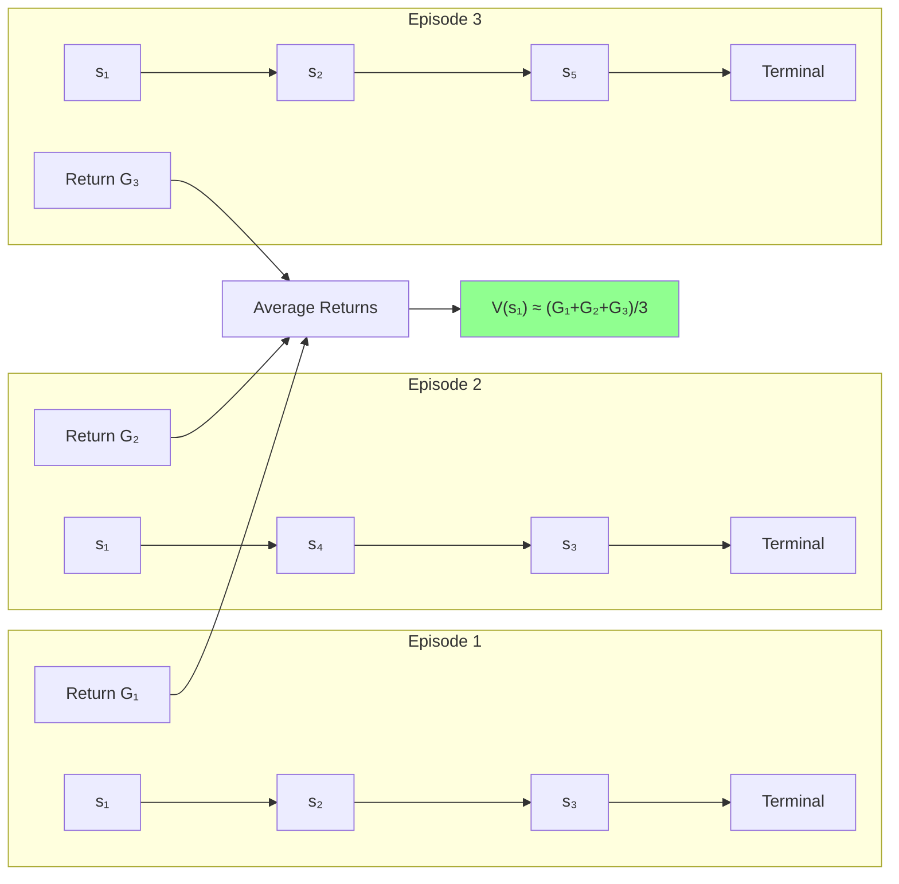
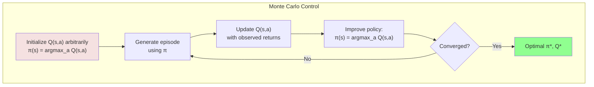
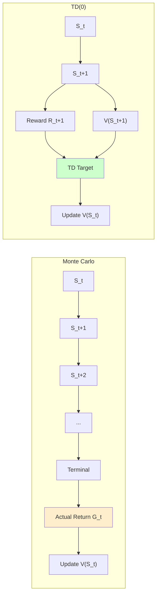
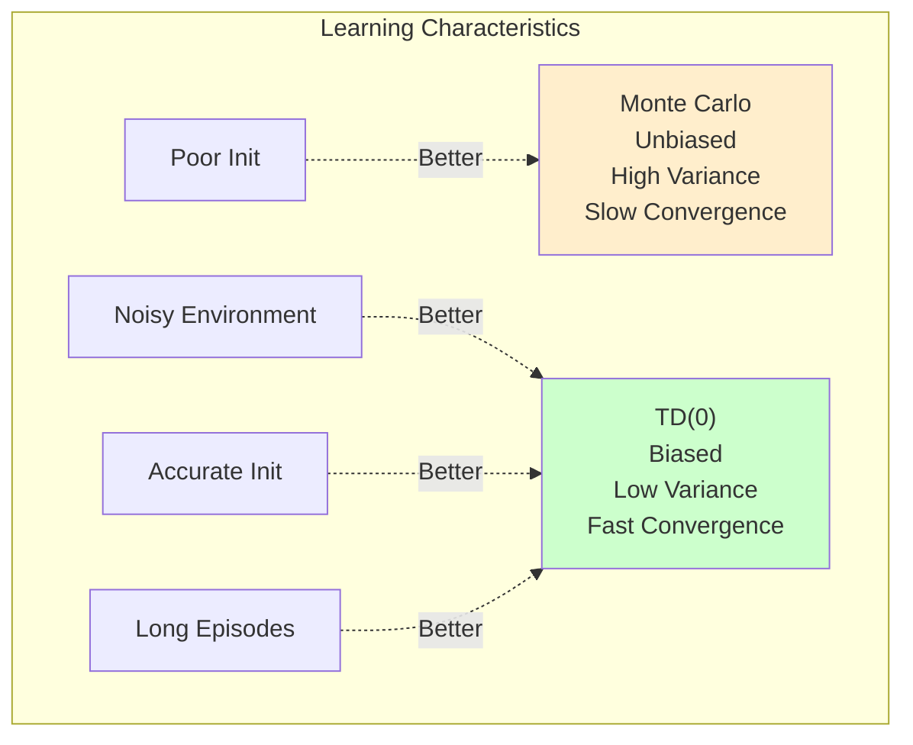
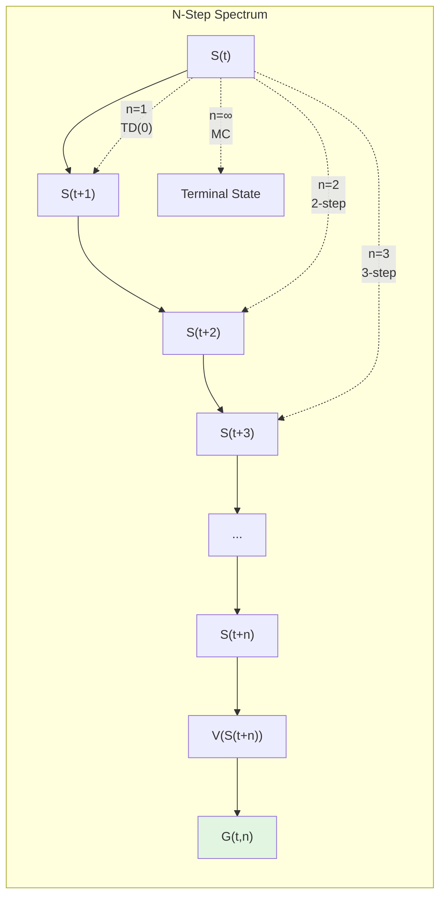
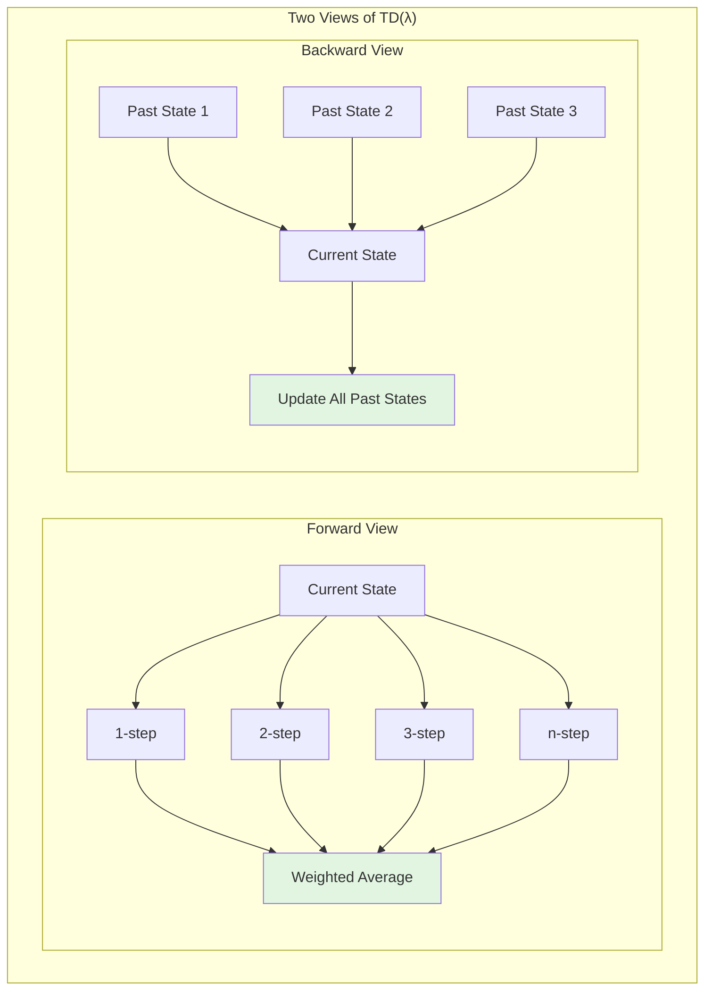

# Chapter 4: Learning from Experience: MC and TD

## The Model-Free Revolution

In the previous chapter, we assumed omniscience—perfect knowledge of how the world works. But reality rarely affords such luxury. Consider learning to play poker: you know the rules, but not the deck order or opponents' strategies. Or training a robot: you understand physics principles, but not precise friction coefficients or motor dynamics. This is where model-free reinforcement learning begins—learning optimal behavior directly from experience, without first learning how the world works.

The shift from model-based to model-free methods represents more than a technical adjustment; it's a philosophical revolution in how we approach intelligence. Instead of the two-step process of "first understand the world, then act optimally," model-free methods embrace "act in the world and learn what works." This approach mirrors biological learning more closely—a child learning to walk doesn't first construct a biomechanical model of their body.

Model-free methods trade theoretical elegance for practical applicability. Where Dynamic Programming required $P(s'|s,a)$ and $R(s,a,s')$ for every possible transition, model-free methods need only the ability to act and observe outcomes. This seemingly simple change opens reinforcement learning to problems where environment dynamics are:
- Too complex to model accurately (weather, financial markets)
- Partially observable (poker, robotics with limited sensors)
- Constantly changing (competitive games, adaptive systems)
- Proprietary or hidden (cloud APIs, compiled games)

Yet this freedom comes with costs. Without a model, we cannot plan ahead mentally. We must experience transitions to learn from them, making sample efficiency a central challenge. The algorithms in this chapter—Monte Carlo and Temporal Difference methods—represent different philosophies for extracting maximum learning from limited experience.

## Monte Carlo Methods: Learning from a Lifetime of Experience

Monte Carlo (MC) methods take their name from the famous casino, reflecting their reliance on randomness and repeated trials. The core insight is beautifully simple: to estimate the value of a state, observe the actual returns received after visiting that state. No model needed—just experience and patience.

### The Monte Carlo Principle

Recall that the value of a state is the expected return when starting from that state:
$$V^\pi(s) = \mathbb{E}_\pi[G_t | S_t = s]$$

where the return $G_t = \sum_{k=0}^{\infty} \gamma^k R_{t+k+1}$ is the discounted sum of future rewards.

Monte Carlo methods estimate this expectation through sampling. After completing episodes, we observe actual returns and average them:



This approach works because of the law of large numbers: as we collect more samples, our estimate converges to the true expected value.

### First-Visit vs. Every-Visit Monte Carlo

A subtle but important choice arises: if a state appears multiple times in an episode, which visits do we use?

**First-Visit MC**: Only use the return following the first visit to each state in an episode
```python
def first_visit_mc_prediction(env, policy, num_episodes, gamma=0.99):
    V = defaultdict(float)
    returns = defaultdict(list)
    
    for episode in range(num_episodes):
        # Generate episode
        states, actions, rewards = generate_episode(env, policy)
        G = 0
        visited = set()
        
        # Work backwards through episode
        for t in reversed(range(len(states))):
            G = gamma * G + rewards[t]
            state = states[t]
            
            if state not in visited:
                visited.add(state)
                returns[state].append(G)
                V[state] = np.mean(returns[state])
    
    return V
```

**Every-Visit MC**: Use returns following every visit to each state
```python
def every_visit_mc_prediction(env, policy, num_episodes, gamma=0.99):
    V = defaultdict(float)
    returns = defaultdict(list)
    
    for episode in range(num_episodes):
        states, actions, rewards = generate_episode(env, policy)
        G = 0
        
        # Work backwards through episode
        for t in reversed(range(len(states))):
            G = gamma * G + rewards[t]
            state = states[t]
            returns[state].append(G)
            V[state] = np.mean(returns[state])
    
    return V
```

Both methods converge to $V^\pi(s)$, but with different theoretical properties:
- First-visit: Unbiased estimate, episodes are independent
- Every-visit: Biased for finite episodes, but often lower variance

### Monte Carlo Control: From Evaluation to Optimization

Evaluation tells us how good a policy is; control finds better policies. MC control follows the Generalized Policy Iteration pattern:



But there's a problem: if our policy is deterministic, we might never explore certain actions. This leads us to the fundamental challenge of exploration.

### The Exploration Problem and ε-Greedy Policies

A greedy policy always chooses the action with highest estimated value. But without trying all actions, how can we know their true values? This exploration-exploitation dilemma is resolved through ε-greedy policies:

$$\pi(a|s) = \begin{cases}
1 - \epsilon + \frac{\epsilon}{|A|} & \text{if } a = \arg\max_{a'} Q(s,a') \\
\frac{\epsilon}{|A|} & \text{otherwise}
\end{cases}$$

With probability $\epsilon$, we explore randomly; otherwise, we exploit our current knowledge.

### Monte Carlo with Exploring Starts

An elegant alternative ensures exploration by randomly selecting the initial state-action pair:

```python
def mc_control_exploring_starts(env, num_episodes, gamma=0.99):
    Q = defaultdict(lambda: defaultdict(float))
    returns = defaultdict(lambda: defaultdict(list))
    policy = defaultdict(lambda: np.random.choice(env.action_space.n))
    
    for episode in range(num_episodes):
        # Exploring start: random state-action pair
        state = env.sample_state()
        action = np.random.choice(env.action_space.n)
        
        # Generate episode from (state, action)
        states, actions, rewards = generate_episode_from(
            env, policy, state, action
        )
        
        G = 0
        visited = set()
        
        for t in reversed(range(len(states))):
            G = gamma * G + rewards[t]
            state, action = states[t], actions[t]
            
            if (state, action) not in visited:
                visited.add((state, action))
                returns[state][action].append(G)
                Q[state][action] = np.mean(returns[state][action])
                
                # Update policy to be greedy
                policy[state] = max(
                    Q[state].keys(), 
                    key=lambda a: Q[state][a]
                )
    
    return policy, Q
```

This guarantees every state-action pair is visited infinitely often, ensuring convergence to optimal values.

### Advantages and Limitations of Monte Carlo

**Advantages:**
- No model required—learns directly from experience
- Handles episodic tasks naturally
- Unbiased estimates of value functions
- Can focus on states of interest (no need to sweep all states)

**Limitations:**
- Requires episodic tasks (must reach terminal states)
- High variance—individual returns can vary wildly
- Slow convergence—must wait until episode ends to update
- Cannot bootstrap—each estimate is independent

These limitations motivate our next family of algorithms, which update values incrementally.

## Temporal-Difference (TD(0)) Learning: The Power of Bootstrapping

If Monte Carlo methods are marathon runners, patiently waiting for the finish line to evaluate their performance, Temporal-Difference methods are sprinters, learning from each step. TD learning combines the model-free nature of Monte Carlo with the bootstrapping of Dynamic Programming, creating algorithms that learn online from incomplete episodes.

### The TD Innovation: Learning from Transitions

The key insight of TD learning is that we don't need to wait for an episode to end. Instead, we can update our value estimates after each transition using our current estimates of future values:

**Monte Carlo update** (wait for actual return $G_t$):
$$V(S_t) \leftarrow V(S_t) + \alpha[G_t - V(S_t)]$$

**TD(0) update** (use estimated future value):
$$V(S_t) \leftarrow V(S_t) + \alpha[R_{t+1} + \gamma V(S_{t+1}) - V(S_t)]$$

The term $R_{t+1} + \gamma V(S_{t+1})$ is called the "TD target"—our current best guess at the true value, combining immediate reward with bootstrapped future value.



### The TD Error: A Signal for Learning

The TD error $\delta_t = R_{t+1} + \gamma V(S_{t+1}) - V(S_t)$ serves as a learning signal:
- Positive error: Transition was better than expected—increase $V(S_t)$
- Negative error: Transition was worse than expected—decrease $V(S_t)$
- Zero error: Our estimates are consistent (but not necessarily correct)

This error appears throughout reinforcement learning, from neural network training to biological models of dopamine signaling.

### TD Prediction Algorithm

```python
def td0_prediction(env, policy, num_episodes, alpha=0.1, gamma=0.99):
    V = defaultdict(float)
    
    for episode in range(num_episodes):
        state = env.reset()
        done = False
        
        while not done:
            action = sample_action(policy, state)
            next_state, reward, done = env.step(action)
            
            # TD(0) update
            td_error = reward + gamma * V[next_state] - V[state]
            V[state] += alpha * td_error
            
            state = next_state
    
    return V
```

The simplicity is deceptive—this algorithm embodies deep principles about learning from temporal sequences.

### SARSA: On-Policy TD Control

To learn optimal policies, we extend TD learning to action values. SARSA (State-Action-Reward-State-Action) updates Q-values using transitions:

$$Q(S_t, A_t) \leftarrow Q(S_t, A_t) + \alpha[R_{t+1} + \gamma Q(S_{t+1}, A_{t+1}) - Q(S_t, A_t)]$$

```python
def sarsa(env, num_episodes, alpha=0.1, gamma=0.99, epsilon=0.1):
    Q = defaultdict(lambda: defaultdict(float))
    
    for episode in range(num_episodes):
        state = env.reset()
        action = epsilon_greedy_action(Q, state, epsilon)
        done = False
        
        while not done:
            next_state, reward, done = env.step(action)
            next_action = epsilon_greedy_action(Q, next_state, epsilon)
            
            # SARSA update
            td_error = (reward + gamma * Q[next_state][next_action] - 
                       Q[state][action])
            Q[state][action] += alpha * td_error
            
            state = next_state
            action = next_action
    
    return Q
```

SARSA is "on-policy" because it updates Q-values using actions from the current policy, including exploratory actions.

### Q-Learning: Off-Policy TD Control

Q-learning makes a subtle but powerful change: instead of using the actual next action, it uses the maximum Q-value:

$$Q(S_t, A_t) \leftarrow Q(S_t, A_t) + \alpha[R_{t+1} + \gamma \max_{a'} Q(S_{t+1}, a') - Q(S_t, A_t)]$$

```python
def q_learning(env, num_episodes, alpha=0.1, gamma=0.99, epsilon=0.1):
    Q = defaultdict(lambda: defaultdict(float))
    
    for episode in range(num_episodes):
        state = env.reset()
        done = False
        
        while not done:
            action = epsilon_greedy_action(Q, state, epsilon)
            next_state, reward, done = env.step(action)
            
            # Q-learning update (off-policy)
            best_next_action = max(Q[next_state], key=Q[next_state].get)
            td_error = (reward + gamma * Q[next_state][best_next_action] - 
                       Q[state][action])
            Q[state][action] += alpha * td_error
            
            state = next_state
    
    return Q
```

This makes Q-learning "off-policy"—it learns optimal Q-values regardless of the exploration policy used.

### Convergence Properties

The convergence of TD methods depends on the learning rate schedule:

**Robbins-Monro conditions** for convergence:
1. $\sum_{t=1}^{\infty} \alpha_t = \infty$ (steps are large enough to overcome initial conditions)
2. $\sum_{t=1}^{\infty} \alpha_t^2 < \infty$ (steps decrease to ensure convergence)

Common schedules:
- Constant: $\alpha_t = \alpha$ (doesn't converge to exact values but works in practice)
- Harmonic: $\alpha_t = \frac{1}{t}$ (theoretically sound but slow)
- Exponential decay: $\alpha_t = \alpha_0 \cdot \gamma^t$ (practical compromise)

### The Bias-Variance Trade-off

TD and MC methods represent different points on the bias-variance spectrum:

**Monte Carlo:**
- Zero bias: Estimates based on actual returns
- High variance: Returns can vary significantly
- No bootstrapping: Each estimate is independent

**TD(0):**
- Biased: Uses current (possibly incorrect) value estimates
- Lower variance: Updates based on single transitions
- Bootstrapping: Estimates build on each other

This trade-off profoundly impacts learning dynamics:



## The N-Step TD Tradeoff: Unifying MC and TD(0)

Between the extremes of TD(0) and Monte Carlo lies a spectrum of algorithms that look ahead n steps before bootstrapping. These n-step methods provide a principled way to trade bias for variance, often achieving better performance than either extreme.

### The N-Step Return

Define the n-step return as:
$$G_t^{(n)} = R_{t+1} + \gamma R_{t+2} + ... + \gamma^{n-1} R_{t+n} + \gamma^n V(S_{t+n})$$

This uses actual rewards for n steps, then bootstraps with the value estimate:
- $n = 1$: TD(0) using immediate reward and next state value
- $n = \infty$: Monte Carlo using complete return
- $1 < n < \infty$: Balanced approach



### N-Step TD Prediction

```python
def n_step_td_prediction(env, policy, num_episodes, n=3, alpha=0.1, gamma=0.99):
    V = defaultdict(float)
    
    for episode in range(num_episodes):
        # Store trajectory
        states = [env.reset()]
        rewards = []
        T = float('inf')
        t = 0
        
        while True:
            if t < T:
                action = sample_action(policy, states[t])
                next_state, reward, done = env.step(action)
                states.append(next_state)
                rewards.append(reward)
                
                if done:
                    T = t + 1
            
            # Update state n steps ago
            tau = t - n + 1
            if tau >= 0:
                # Compute n-step return
                G = 0
                for i in range(tau + 1, min(tau + n + 1, T + 1)):
                    G += gamma**(i - tau - 1) * rewards[i - 1]
                
                if tau + n < T:
                    G += gamma**n * V[states[tau + n]]
                
                # Update value
                V[states[tau]] += alpha * (G - V[states[tau]])
            
            if tau == T - 1:
                break
                
            t += 1
    
    return V
```

### N-Step SARSA and Q-Learning

The n-step idea extends naturally to control:

**N-Step SARSA**: Use actual actions taken
$$G_t^{(n)} = R_{t+1} + \gamma R_{t+2} + ... + \gamma^{n-1} R_{t+n} + \gamma^n Q(S_{t+n}, A_{t+n})$$

**N-Step Q-Learning**: Use maximum Q-values
$$G_t^{(n)} = R_{t+1} + \gamma R_{t+2} + ... + \gamma^{n-1} R_{t+n} + \gamma^n \max_a Q(S_{t+n}, a)$$

### Choosing N: The Sweet Spot

The optimal n depends on the problem:

```python
def analyze_n_step_performance(env, policy, n_values=[1, 2, 4, 8, 16, 32]):
    errors = {n: [] for n in n_values}
    true_V = compute_true_values(env, policy)  # Assume we can compute this
    
    for n in n_values:
        V = n_step_td_prediction(env, policy, num_episodes=1000, n=n)
        error = mean_squared_error(V, true_V)
        errors[n].append(error)
    
    # Often see U-shaped curve: error high for n=1 (high bias) 
    # and n=∞ (high variance), minimum at intermediate n
    return errors
```

Empirically, intermediate values (n = 4 to 16) often work best, providing a good bias-variance balance.

### TD(λ): Averaging All N-Step Returns

Instead of choosing a single n, why not use them all? TD(λ) computes a weighted average of all n-step returns:

$$G_t^\lambda = (1-\lambda) \sum_{n=1}^{\infty} \lambda^{n-1} G_t^{(n)}$$

The parameter λ ∈ [0,1] controls the weighting:
- λ = 0: Only 1-step return (TD(0))
- λ = 1: Monte Carlo return
- 0 < λ < 1: Exponentially weighted average

This elegant formulation leads to efficient algorithms using eligibility traces, which we'll explore in later chapters.

### Forward View vs. Backward View

The n-step methods presented here use the "forward view"—looking ahead n steps from each state. TD(λ) has an equivalent "backward view" using eligibility traces that updates all previously visited states:



Both views are mathematically equivalent but lead to different implementations.

### Practical Considerations

When implementing n-step methods:

1. **Memory Requirements**: Must store n steps of trajectory
2. **Delay**: Cannot update until n steps later
3. **Episode Boundaries**: Handle terminal states carefully
4. **Parameter Sensitivity**: Performance more sensitive to α with larger n

Despite these challenges, n-step methods often provide the best practical performance, combining the strengths of both TD and MC approaches.

The journey from Monte Carlo through TD(0) to n-step methods illustrates a fundamental principle in reinforcement learning: there's rarely a single best algorithm. Instead, we have a spectrum of approaches, each with strengths suited to different problems. Understanding this spectrum—and the principles underlying it—equips us to choose and adapt methods for the challenges we face.

As we move forward to more complex algorithms, remember that these simple methods remain remarkably effective. TD learning, in particular, forms the conceptual foundation for deep reinforcement learning. The idea of bootstrapping—learning from our own estimates—appears again and again, scaled up to neural networks but fundamentally unchanged from the elegant algorithms we've explored here.