# Chapter 5: The Cornerstone Algorithm: A Deep Dive into Q-Learning

## On-Policy vs. Off-Policy Learning: A Critical Distinction

Before we dive into Q-learning's elegant machinery, we must understand a distinction that cuts to the heart of reinforcement learning: the difference between on-policy and off-policy learning. This distinction, subtle at first glance, has profound implications for how agents learn, explore, and ultimately achieve optimal behavior.

### The Two Policies in Off-Policy Learning

In off-policy learning, we maintain a conceptual separation between two policies:

1. **Behavior Policy (μ)**: The policy used to generate experience—how the agent actually acts
2. **Target Policy (π)**: The policy being evaluated or improved—what we're learning about

```mermaid
graph TB
    subgraph "On-Policy Learning"
        P1[Policy π] -->|Generates| E1[Experience]
        E1 -->|Updates| P1
        P1 -->|"Same policy"| P1
    end
    
    subgraph "Off-Policy Learning"
        B[Behavior Policy μ] -->|Generates| E2[Experience]
        E2 -->|Updates| T[Target Policy π]
        T -.->|"Different policies"| B
    end
    
    style P1 fill:#e1f5e1
    style B fill:#f5e1e1
    style T fill:#e1e5f5
```



This separation enables powerful capabilities:
- Learn about optimal policy while following exploratory policy
- Learn from demonstrations, historical data, or other agents
- Improve sample efficiency by reusing experience

### Why Off-Policy Matters

Consider learning to play chess. On-policy learning is like only learning from games where you played your current best strategy. Off-policy learning lets you learn from:
- Games where you tried wild experiments
- Games played by masters
- Games from historical databases
- Even games where you played randomly

This flexibility transforms the learning problem. Instead of being confined to learning from our current behavior, we can extract value from any experience where we know what actions were taken.

### The Challenge: Distribution Mismatch

Off-policy learning's power comes with a price: the distribution of states we visit (under μ) may differ from the distribution we care about (under π). This mismatch can lead to:

```python
# Illustration of distribution mismatch
def analyze_state_distribution(env, behavior_policy, target_policy, num_episodes=1000):
    behavior_visits = defaultdict(int)
    target_visits = defaultdict(int)
    
    # States visited under behavior policy
    for _ in range(num_episodes):
        state = env.reset()
        while not done:
            behavior_visits[state] += 1
            action = behavior_policy(state)
            state, _, done = env.step(action)
    
    # States that would be visited under target policy
    for _ in range(num_episodes):
        state = env.reset()
        while not done:
            target_visits[state] += 1
            action = target_policy(state)
            state, _, done = env.step(action)
    
    # Divergence between distributions
    states = set(behavior_visits.keys()) | set(target_visits.keys())
    kl_divergence = sum(
        target_visits[s]/sum(target_visits.values()) * 
        np.log((target_visits[s]/sum(target_visits.values())) / 
               (behavior_visits[s]/sum(behavior_visits.values()) + 1e-8))
        for s in states if target_visits[s] > 0
    )
    
    return kl_divergence
```

High divergence means we're learning about states we rarely visit under the target policy—potentially wasting effort or developing brittle policies.

### Importance Sampling: The Classical Solution

Traditional off-policy methods use importance sampling to correct for distribution mismatch:

$$\mathbb{E}_{s \sim \mu}[f(s)] = \mathbb{E}_{s \sim \pi}\left[\frac{\mu(s)}{\pi(s)} f(s)\right]$$

But Q-learning sidesteps this complexity entirely through a clever insight we'll explore next.

## The Bellman Optimality Equation as an Update Rule

Q-learning's genius lies in transforming the Bellman optimality equation from a characterization of optimal values into a practical update rule. This transformation is so elegant that it's easy to miss its profundity.

### From Equation to Algorithm

Recall the Bellman optimality equation for action values:
$$Q^*(s,a) = \sum_{s'} P(s'|s,a)\left[R(s,a,s') + \gamma \max_{a'} Q^*(s',a')\right]$$

In the model-free setting, we can't compute this expectation directly. Q-learning's insight: use samples to approximate it. When we observe a transition $(s,a,r,s')$, we have a single sample from the distribution $P(s'|s,a)$. This gives us the update:

$$Q(s,a) \leftarrow Q(s,a) + \alpha\left[r + \gamma \max_{a'} Q(s',a') - Q(s,a)\right]$$

### The Update Rule Dissected

Let's examine each component:

```mermaid
graph LR
    subgraph "Q-Learning Update Components"
        TD["TD Target"] --> |"r + γ max_a' Q(s',a')"| Target
        Current["Current Estimate"] --> |"Q(s,a)"| Estimate
        Target --> Error["TD Error"]
        Estimate --> Error
        Error --> |"α × error"| Update["New Q(s,a)"]
    end
    
    style TD fill:#e1f5e1
    style Error fill:#f5f5e1
    style Update fill:#e1e5f5
```



1. **Current Estimate**: $Q(s,a)$ - Our current belief about the value
2. **TD Target**: $r + \gamma \max_{a'} Q(s',a')$ - Our updated belief based on new evidence
3. **TD Error**: Target - Current - How wrong we were
4. **Learning Rate**: $\alpha$ - How much we trust new evidence

### Why Maximum? The Optimality Assumption

The key insight is using $\max_{a'} Q(s',a')$ rather than following any particular policy. This assumes optimal behavior from the next state onward, regardless of how we actually behave. This optimistic assumption:
- Directly targets optimal values
- Requires no importance sampling
- Enables learning from any behavior policy

```python
def q_learning_update(Q, state, action, reward, next_state, alpha, gamma):
    """
    The fundamental Q-learning update.
    
    This simple function embodies the core insight that enables
    off-policy learning without importance sampling.
    """
    # Current estimate
    current_q = Q[state][action]
    
    # Optimal future value (not following current policy!)
    max_future_q = max(Q[next_state].values()) if next_state else 0
    
    # TD target assumes optimal behavior from next state
    td_target = reward + gamma * max_future_q
    
    # Update toward target
    Q[state][action] += alpha * (td_target - current_q)
    
    return Q
```

### Convergence Despite Off-Policy

Q-learning converges to optimal Q-values under mild conditions:
1. All state-action pairs continue to be visited
2. Learning rate satisfies Robbins-Monro conditions
3. Environment is Markovian

Remarkably, convergence holds regardless of the behavior policy, as long as it maintains exploration. This robustness makes Q-learning practical for real applications.

## The Full Q-Learning Algorithm: A Step-by-Step Walkthrough

Let's build Q-learning from the ground up, starting with the core insight and gradually adding the components that make it practical.

### Building Block 1: The Q-Value Update

At its heart, Q-learning is about updating our estimates of action values based on experience. Let's start with the simplest possible implementation:

```python
def basic_q_update(Q, state, action, reward, next_state, alpha=0.1, gamma=0.99):
    """
    The fundamental Q-learning update rule.
    
    This function is the atomic unit of Q-learning - everything else
    is built around this simple update.
    """
    # What's the best we can do from the next state?
    if next_state is not None:
        max_next_q = max(Q[next_state].values()) if Q[next_state] else 0.0
    else:
        max_next_q = 0.0  # Terminal state has no future
    
    # The target: immediate reward + discounted optimal future
    target = reward + gamma * max_next_q
    
    # How wrong were we?
    error = target - Q[state][action]
    
    # Update our estimate
    Q[state][action] += alpha * error
    
    return error  # Useful for debugging
```

This simple function embodies the key insight: we update toward what we would get if we acted optimally from the next state onward, regardless of what we actually did.

### Building Block 2: Action Selection

Next, we need a way to choose actions. The challenge is balancing exploration (trying new things) with exploitation (using what we know):

```python
def epsilon_greedy_action(Q, state, epsilon, action_space):
    """
    ε-greedy action selection: the workhorse of exploration.
    
    With probability ε: explore (random action)
    With probability 1-ε: exploit (best known action)
    """
    if random.random() < epsilon:
        # Explore: choose randomly
        return action_space.sample()
    else:
        # Exploit: choose the best known action
        if state in Q and Q[state]:
            # If we have estimates, use them
            return max(Q[state], key=Q[state].get)
        else:
            # If we know nothing, any action is as good as any other
            return action_space.sample()
```

### Building Block 3: The Episode Loop

Now we can build a complete episode of learning:

```python
def run_q_learning_episode(env, Q, alpha=0.1, gamma=0.99, epsilon=0.1):
    """
    Run one episode of Q-learning.
    
    This function orchestrates the learning process for a single episode,
    from reset to termination.
    """
    state = env.reset()
    done = False
    
    episode_reward = 0
    episode_steps = 0
    episode_errors = []  # Track learning progress
    
    while not done:
        # 1. Choose action
        action = epsilon_greedy_action(Q, state, epsilon, env.action_space)
        
        # 2. Take action in environment
        next_state, reward, done = env.step(action)
        
        # 3. Update Q-values
        error = basic_q_update(Q, state, action, reward, next_state, alpha, gamma)
        episode_errors.append(abs(error))
        
        # 4. Track progress
        episode_reward += reward
        episode_steps += 1
        
        # 5. Prepare for next step
        state = next_state
    
    return episode_reward, episode_steps, episode_errors
```

### Building Block 4: The Complete Algorithm

Now we can assemble the full Q-learning algorithm with proper initialization and tracking:

```python
from collections import defaultdict
import numpy as np

def q_learning(env, num_episodes, alpha=0.1, gamma=0.99, epsilon=0.1):
    """
    Complete Q-Learning implementation with tracking and analysis.
    
    This implementation includes everything needed for practical use:
    - Proper initialization
    - Episode tracking
    - Performance metrics
    - Convergence monitoring
    """
    # Initialize Q-values
    # Using defaultdict avoids KeyError and provides automatic initialization
    Q = defaultdict(lambda: defaultdict(float))
    
    # Tracking variables
    episode_rewards = []
    episode_lengths = []
    episode_mean_errors = []
    
    # Optional: track state-action visit counts
    visit_counts = defaultdict(lambda: defaultdict(int))
    
    for episode in range(num_episodes):
        # Run one episode
        reward, steps, errors = run_q_learning_episode(
            env, Q, alpha, gamma, epsilon
        )
        
        # Track metrics
        episode_rewards.append(reward)
        episode_lengths.append(steps)
        episode_mean_errors.append(np.mean(errors) if errors else 0)
        
        # Optional: decay epsilon over time
        # epsilon = max(0.01, epsilon * 0.995)
        
        # Optional: print progress
        if episode % 100 == 0:
            recent_rewards = episode_rewards[-100:]
            avg_reward = np.mean(recent_rewards)
            avg_error = np.mean(episode_mean_errors[-100:])
            print(f"Episode {episode}: Avg Reward = {avg_reward:.2f}, "
                  f"Avg Error = {avg_error:.4f}, States Known = {len(Q)}")
    
    return Q, {
        'episode_rewards': episode_rewards,
        'episode_lengths': episode_lengths,
        'episode_errors': episode_mean_errors,
        'final_Q': Q
    }
```

### Key Design Decisions

#### 1. Initialization Strategy

Q-values initialization significantly impacts exploration:

```python
# Optimistic initialization encourages exploration
Q_optimistic = defaultdict(lambda: defaultdict(lambda: 10.0))

# Pessimistic initialization favors exploitation  
Q_pessimistic = defaultdict(lambda: defaultdict(lambda: -10.0))

# Zero initialization is neutral
Q_zero = defaultdict(lambda: defaultdict(lambda: 0.0))
```

Optimistic initialization works well when rewards are mostly negative (e.g., -1 per step), as it encourages trying each action at least once.

#### 2. Exploration Strategy

While ε-greedy is simple and effective, alternatives exist:

```python
def boltzmann_exploration(Q, state, temperature=1.0):
    """Softmax action selection based on Q-values."""
    q_values = np.array([Q[state][a] for a in range(env.action_space.n)])
    exp_values = np.exp(q_values / temperature)
    probabilities = exp_values / np.sum(exp_values)
    return np.random.choice(env.action_space.n, p=probabilities)

def ucb_exploration(Q, N, state, c=2.0):
    """Upper Confidence Bound exploration."""
    q_values = np.array([Q[state][a] for a in range(env.action_space.n)])
    counts = np.array([N[state][a] for a in range(env.action_space.n)])
    
    # UCB bonus for less-visited actions
    total_counts = np.sum(counts)
    ucb_values = q_values + c * np.sqrt(np.log(total_counts + 1) / (counts + 1))
    
    return np.argmax(ucb_values)
```

#### 3. Learning Rate Scheduling

Adaptive learning rates improve convergence:

```python
def get_learning_rate(episode, initial_alpha=1.0, decay_rate=0.99):
    """Decay learning rate over time."""
    return initial_alpha * (decay_rate ** episode)

def state_based_learning_rate(state_visits, initial_alpha=1.0):
    """Higher learning rate for rarely visited states."""
    return initial_alpha / (1 + state_visits ** 0.5)
```

### Advanced Implementation with Features

Real-world Q-learning often includes additional features:

```python
class AdvancedQLearning:
    def __init__(self, env, alpha=0.1, gamma=0.99, epsilon=0.1):
        self.env = env
        self.alpha = alpha
        self.gamma = gamma
        self.epsilon = epsilon
        
        # Q-values and auxiliary data
        self.Q = defaultdict(lambda: defaultdict(float))
        self.state_visits = defaultdict(int)
        self.state_action_visits = defaultdict(lambda: defaultdict(int))
        
        # Experience replay buffer
        self.replay_buffer = deque(maxlen=10000)
        
    def get_action(self, state, training=True):
        """ε-greedy action selection with decay."""
        if training and np.random.random() < self.epsilon:
            return self.env.action_space.sample()
        else:
            return max(self.Q[state], key=self.Q[state].get)
    
    def update(self, state, action, reward, next_state, done):
        """Q-learning update with experience replay."""
        # Store transition
        self.replay_buffer.append((state, action, reward, next_state, done))
        
        # Update visit counts
        self.state_visits[state] += 1
        self.state_action_visits[state][action] += 1
        
        # Standard Q-learning update
        if next_state is not None:
            best_next_q = max(self.Q[next_state].values()) if self.Q[next_state] else 0
        else:
            best_next_q = 0
            
        td_target = reward + self.gamma * best_next_q * (not done)
        td_error = td_target - self.Q[state][action]
        
        # Adaptive learning rate
        alpha = self.alpha / (1 + self.state_action_visits[state][action] ** 0.5)
        self.Q[state][action] += alpha * td_error
        
        # Experience replay
        if len(self.replay_buffer) > 32:
            self.replay()
    
    def replay(self, batch_size=32):
        """Learn from random past experiences."""
        batch = random.sample(self.replay_buffer, batch_size)
        
        for state, action, reward, next_state, done in batch:
            if next_state is not None:
                best_next_q = max(self.Q[next_state].values()) if self.Q[next_state] else 0
            else:
                best_next_q = 0
                
            td_target = reward + self.gamma * best_next_q * (not done)
            td_error = td_target - self.Q[state][action]
            
            # Lower learning rate for replay
            self.Q[state][action] += 0.5 * self.alpha * td_error
    
    def train(self, num_episodes):
        """Full training loop with decay schedules."""
        episode_rewards = []
        
        for episode in range(num_episodes):
            # Decay exploration
            self.epsilon = max(0.01, self.epsilon * 0.995)
            
            state = self.env.reset()
            done = False
            total_reward = 0
            
            while not done:
                action = self.get_action(state)
                next_state, reward, done = self.env.step(action)
                
                self.update(state, action, reward, next_state, done)
                
                total_reward += reward
                state = next_state
            
            episode_rewards.append(total_reward)
            
            if episode % 100 == 0:
                avg_reward = np.mean(episode_rewards[-100:])
                print(f"Episode {episode}, Average Reward: {avg_reward:.2f}, ε: {self.epsilon:.3f}")
        
        return episode_rewards
```

### Debugging Q-Learning

When Q-learning fails to learn, systematic debugging helps:

```python
def debug_q_learning(agent, env, num_episodes=10):
    """Diagnostic tool for Q-learning issues."""
    
    print("=== Q-Learning Diagnostics ===")
    
    # 1. Check exploration
    actions_taken = defaultdict(int)
    for _ in range(100):
        state = env.reset()
        action = agent.get_action(state)
        actions_taken[action] += 1
    
    print(f"\nAction distribution: {dict(actions_taken)}")
    if min(actions_taken.values()) == 0:
        print("WARNING: Some actions never explored!")
    
    # 2. Check Q-value magnitudes
    all_q_values = []
    for state_q in agent.Q.values():
        all_q_values.extend(state_q.values())
    
    if all_q_values:
        print(f"\nQ-value statistics:")
        print(f"  Mean: {np.mean(all_q_values):.3f}")
        print(f"  Std:  {np.std(all_q_values):.3f}")
        print(f"  Min:  {np.min(all_q_values):.3f}")
        print(f"  Max:  {np.max(all_q_values):.3f}")
        
        if np.std(all_q_values) < 0.01:
            print("WARNING: Q-values not differentiating!")
    
    # 3. Check learning progress
    initial_performance = evaluate_policy(agent, env, episodes=10)
    agent.train(100)
    final_performance = evaluate_policy(agent, env, episodes=10)
    
    print(f"\nPerformance improvement: {initial_performance:.2f} -> {final_performance:.2f}")
    if final_performance <= initial_performance:
        print("WARNING: No improvement detected!")
    
    # 4. Visualize Q-values for specific states
    if hasattr(env, 'get_test_states'):
        test_states = env.get_test_states()
        print("\nQ-values for test states:")
        for state in test_states:
            q_vals = [agent.Q[state][a] for a in range(env.action_space.n)]
            print(f"  State {state}: {q_vals}")
            print(f"    Best action: {np.argmax(q_vals)}")
```

## Code Project: Implementing Q-Learning from Scratch for a Custom Environment

Let's build a complete Q-learning implementation for a custom environment that showcases the algorithm's strengths. We'll create a treasure hunting game where an agent must navigate a grid world, collecting rewards while avoiding hazards.

### Step 1: Designing the Environment

First, let's think about what makes a good environment for demonstrating Q-learning:
- **Sparse rewards**: The agent must learn to reach distant goals
- **Negative rewards**: The agent must learn to avoid certain states
- **Stochastic elements**: To show Q-learning's robustness
- **Multiple objectives**: To demonstrate complex decision-making

```python
import numpy as np
import matplotlib.pyplot as plt
from matplotlib.patches import Rectangle, Circle
import matplotlib.patches as mpatches
from collections import defaultdict, deque
import random

class TreasureHuntEnv:
    """
    A grid world where an agent hunts for treasure while avoiding traps.
    
    This environment demonstrates key challenges for Q-learning:
    - Delayed rewards (must navigate to treasures)
    - Negative rewards (must learn to avoid traps)
    - Limited time (battery constraint)
    - Progressive difficulty (keys and doors)
    """
    
    def __init__(self, width=10, height=10, num_treasures=3, num_traps=5):
        self.width = width
        self.height = height
        
        # Core components
        self._setup_grid()
        self._place_objects(num_treasures, num_traps)
        self._setup_action_space()
        
        # Episode tracking
        self.reset()
    
    def _setup_grid(self):
        """Initialize the grid structure."""
        self.grid = np.zeros((self.height, self.width))
        self.start_pos = (0, 0)
        
    def _place_objects(self, num_treasures, num_traps):
        """Place treasures, traps, and other objects on the grid."""
        # Treasures: positive rewards of varying values
        self.treasures = {}
        treasure_positions = self._random_positions(num_treasures, exclude=[self.start_pos])
        for i, pos in enumerate(treasure_positions):
            value = (i + 1) * 10  # 10, 20, 30 points
            self.treasures[pos] = value
            self.grid[pos] = 1  # Mark on grid
        
        # Traps: negative rewards that end the episode
        self.traps = set()
        trap_positions = self._random_positions(
            num_traps, 
            exclude=[self.start_pos] + list(self.treasures.keys())
        )
        for pos in trap_positions:
            self.traps.add(pos)
            self.grid[pos] = -1  # Mark on grid
        
        # Advanced feature: keys and doors
        # This creates a hierarchical task structure
        self.doors = {(self.height//2, self.width//2)}  # Center door
        self.keys = {(2, 2): (self.height//2, self.width//2)}  # Key location -> door location
        
    def _setup_action_space(self):
        """Define the action space."""
        # Four discrete actions: up, right, down, left
        self.actions = {
            0: (-1, 0),  # Up
            1: (0, 1),   # Right
            2: (1, 0),   # Down
            3: (0, -1)   # Left
        }
        
        # Create a simple action space object compatible with standard RL interfaces
        self.action_space = type('ActionSpace', (), {
            'n': 4,
            'sample': lambda: np.random.randint(4)
        })()
        
    def reset(self):
        """Reset the environment to start a new episode."""
        self.agent_pos = self.start_pos
        self.collected_treasures = set()
        self.collected_keys = set()
        self.total_reward = 0
        
        # Battery: adds time pressure
        self.max_battery = 100
        self.battery = self.max_battery
        
        return self._get_state()
        
    def _random_positions(self, n, exclude):
        """Generate n random positions excluding certain cells."""
        positions = []
        while len(positions) < n:
            pos = (np.random.randint(self.height), np.random.randint(self.width))
            if pos not in exclude and pos not in positions:
                positions.append(pos)
        return positions
    
    def reset(self):
        """Reset environment to initial state."""
        self.agent_pos = self.start_pos
        self.battery = self.max_battery
        self.collected_treasures = set()
        self.collected_keys = set()
        self.total_reward = 0
        return self._get_state()
    
    def _get_state(self):
        """
        Encode the current state as a hashable tuple.
        
        State representation is crucial for Q-learning. We need to capture
        all information that affects future rewards:
        - Current position
        - What we've collected (affects available rewards)
        - What keys we have (affects accessible areas)
        - Time remaining (affects optimal policy)
        """
        return (
            self.agent_pos,
            frozenset(self.collected_treasures),
            frozenset(self.collected_keys),
            self.battery // 10  # Discretize battery to reduce state space
        )
    
    def step(self, action):
        """
        Execute an action and return the result.
        
        This is where the environment dynamics are defined. Each action
        can lead to movement, rewards, or termination.
        
        Returns:
            tuple: (next_state, reward, done)
        """
        # 1. Movement dynamics
        dy, dx = self.actions[action]
        new_pos = (self.agent_pos[0] + dy, self.agent_pos[1] + dx)
        
        # Check if move is valid
        if self._is_valid_position(new_pos):
            # Check for locked doors
            if new_pos in self.doors and new_pos not in self.collected_keys:
                new_pos = self.agent_pos  # Can't pass through
            else:
                self.agent_pos = new_pos  # Move successful
        else:
            new_pos = self.agent_pos  # Hit wall, stay put
        
        # 2. Time dynamics
        self.battery -= 1
        
        # 3. Reward calculation
        reward = self._calculate_reward()
        
        # 4. Check termination conditions
        done = self._check_termination()
        
        # 5. Update total score
        self.total_reward += reward
        
        return self._get_state(), reward, done
    
    def _is_valid_position(self, pos):
        """Check if a position is within grid boundaries."""
        row, col = pos
        return 0 <= row < self.height and 0 <= col < self.width
    
    def _calculate_reward(self):
        """
        Calculate reward for current position.
        
        Reward structure teaches the agent:
        - Move efficiently (small step penalty)
        - Collect treasures (large positive rewards)
        - Avoid traps (large negative rewards)
        - Collect keys (small positive rewards)
        """
        reward = -0.1  # Base step penalty encourages efficiency
        
        # Treasure collection
        if self.agent_pos in self.treasures and self.agent_pos not in self.collected_treasures:
            treasure_value = self.treasures[self.agent_pos]
            reward += treasure_value
            self.collected_treasures.add(self.agent_pos)
            
            # Bonus for collecting all treasures
            if len(self.collected_treasures) == len(self.treasures):
                reward += 50  # Completion bonus
        
        # Trap penalty
        if self.agent_pos in self.traps:
            reward = -50  # Override other rewards
        
        # Key collection
        if self.agent_pos in self.keys:
            door_pos = self.keys[self.agent_pos]
            if door_pos not in self.collected_keys:
                self.collected_keys.add(door_pos)
                reward += 5  # Small reward for progress
        
        return reward
    
    def _check_termination(self):
        """Check if episode should end."""
        # Victory: collected all treasures
        if len(self.collected_treasures) == len(self.treasures):
            return True
        
        # Defeat: stepped on trap
        if self.agent_pos in self.traps:
            return True
        
        # Timeout: battery depleted
        if self.battery <= 0:
            return True
        
        return False
    
    def render(self, Q=None):
        """Visualize the environment and optionally Q-values."""
        fig, ax = plt.subplots(figsize=(10, 10))
        
        # Draw grid
        for i in range(self.height + 1):
            ax.axhline(i, color='black', linewidth=1)
        for j in range(self.width + 1):
            ax.axvline(j, color='black', linewidth=1)
        
        # Draw treasures
        for pos, value in self.treasures.items():
            if pos not in self.collected_treasures:
                y, x = pos
                circle = Circle((x + 0.5, y + 0.5), 0.3, 
                               color='gold', ec='orange', linewidth=2)
                ax.add_patch(circle)
                ax.text(x + 0.5, y + 0.5, f'${value}', 
                       ha='center', va='center', fontsize=10, fontweight='bold')
        
        # Draw traps
        for pos in self.traps:
            y, x = pos
            rect = Rectangle((x + 0.1, y + 0.1), 0.8, 0.8,
                           facecolor='red', alpha=0.7)
            ax.add_patch(rect)
            ax.text(x + 0.5, y + 0.5, '⚠', 
                   ha='center', va='center', fontsize=20)
        
        # Draw doors and keys
        for door_pos in self.doors:
            y, x = door_pos
            if door_pos not in self.collected_keys:
                rect = Rectangle((x + 0.1, y + 0.1), 0.8, 0.8,
                               facecolor='brown', alpha=0.8)
                ax.add_patch(rect)
                ax.text(x + 0.5, y + 0.5, '🚪', 
                       ha='center', va='center', fontsize=16)
        
        for key_pos, door_pos in self.keys.items():
            if door_pos not in self.collected_keys:
                y, x = key_pos
                ax.text(x + 0.5, y + 0.5, '🔑', 
                       ha='center', va='center', fontsize=16)
        
        # Draw agent
        y, x = self.agent_pos
        circle = Circle((x + 0.5, y + 0.5), 0.25,
                       color='blue', alpha=0.8)
        ax.add_patch(circle)
        
        # Draw Q-values if provided
        if Q is not None:
            state = self._get_state()
            if state in Q:
                y, x = self.agent_pos
                for action, (dy, dx) in self.actions.items():
                    q_value = Q[state][action]
                    ax.arrow(x + 0.5, y + 0.5, dx * 0.3, dy * 0.3,
                           head_width=0.1, head_length=0.05,
                           fc='green' if q_value > 0 else 'red',
                           alpha=min(abs(q_value) / 10, 1.0))
        
        # Battery indicator
        ax.text(self.width + 0.5, 0.5, f'Battery: {self.battery}', 
               fontsize=12, fontweight='bold',
               color='green' if self.battery > 30 else 'red')
        
        # Score
        ax.text(self.width + 0.5, 1.5, f'Score: {self.total_reward:.1f}', 
               fontsize=12, fontweight='bold')
        
        ax.set_xlim(0, self.width)
        ax.set_ylim(0, self.height)
        ax.set_aspect('equal')
        ax.invert_yaxis()
        ax.set_title('Treasure Hunt Environment', fontsize=16, fontweight='bold')
        
        # Legend
        legend_elements = [
            mpatches.Patch(color='gold', label='Treasure'),
            mpatches.Patch(color='red', label='Trap'),
            mpatches.Patch(color='brown', label='Door'),
            mpatches.Patch(color='blue', label='Agent')
        ]
        ax.legend(handles=legend_elements, loc='upper left', 
                 bbox_to_anchor=(1.1, 1))
        
        plt.tight_layout()
        return fig, ax
```

### Step 2: Building the Q-Learning Agent

Now let's build our Q-learning agent step by step, starting with the core components and gradually adding sophistication.

#### Basic Q-Learning Agent

First, let's create a minimal Q-learning agent:

```python
class BasicQLearningAgent:
    """
    A minimal Q-learning implementation to demonstrate the core algorithm.
    """
    
    def __init__(self, env, alpha=0.1, gamma=0.99, epsilon=0.1):
        self.env = env
        self.alpha = alpha      # Learning rate
        self.gamma = gamma      # Discount factor
        self.epsilon = epsilon  # Exploration rate
        
        # Q-table: maps (state, action) pairs to values
        self.Q = defaultdict(lambda: defaultdict(float))
        
    def get_action(self, state):
        """ε-greedy action selection."""
        if random.random() < self.epsilon:
            return self.env.action_space.sample()
        else:
            # Choose best action, breaking ties randomly
            q_values = [self.Q[state][a] for a in range(self.env.action_space.n)]
            max_q = max(q_values) if q_values else 0
            best_actions = [a for a, q in enumerate(q_values) if q == max_q]
            return random.choice(best_actions)
    
    def learn(self, state, action, reward, next_state, done):
        """Update Q-values based on experience."""
        # Current Q-value
        current_q = self.Q[state][action]
        
        # Best Q-value for next state
        if done:
            max_next_q = 0  # Terminal state has no future
        else:
            next_q_values = [self.Q[next_state][a] 
                           for a in range(self.env.action_space.n)]
            max_next_q = max(next_q_values) if next_q_values else 0
        
        # Q-learning update
        target = reward + self.gamma * max_next_q
        self.Q[state][action] += self.alpha * (target - current_q)
    
    def train_episode(self):
        """Run one episode of training."""
        state = self.env.reset()
        total_reward = 0
        steps = 0
        
        while True:
            # Choose action
            action = self.get_action(state)
            
            # Take action
            next_state, reward, done = self.env.step(action)
            
            # Learn from experience
            self.learn(state, action, reward, next_state, done)
            
            # Update tracking
            total_reward += reward
            steps += 1
            state = next_state
            
            if done:
                break
                
        return total_reward, steps
```

This basic agent implements the essential Q-learning algorithm. Now let's enhance it with practical features.

#### Enhanced Q-Learning Agent

```python
class TreasureHuntQLearning:
    """
    An advanced Q-learning agent with features for practical learning.
    
    Enhancements over basic agent:
    - Optimistic initialization for exploration
    - Epsilon decay for exploration scheduling
    - State visit tracking for analysis
    - Experience replay for sample efficiency
    """
    
    def __init__(self, env, alpha=0.1, gamma=0.99, epsilon=1.0):
        self.env = env
        self.alpha = alpha
        self.gamma = gamma
        self.epsilon = epsilon
        self.epsilon_min = 0.01
        self.epsilon_decay = 0.995
        
        # Optimistic initialization encourages exploration
        # By starting with high values, the agent will try each action
        # at least once before settling on exploitation
        self.Q = defaultdict(lambda: defaultdict(lambda: 5.0))
        
        # Tracking for analysis
        self.state_visits = defaultdict(int)
        self.episode_rewards = []
        self.episode_lengths = []
        
        # Experience replay buffer
        self.memory = deque(maxlen=5000)
        
    def get_action(self, state, training=True):
        """ε-greedy action selection with decay."""
        if training and np.random.random() < self.epsilon:
            return self.env.action_space.sample()
        else:
            # Break ties randomly for equal Q-values
            q_values = [self.Q[state][a] for a in range(self.env.action_space.n)]
            max_q = max(q_values)
            best_actions = [a for a, q in enumerate(q_values) if q == max_q]
            return np.random.choice(best_actions)
    
    def remember(self, state, action, reward, next_state, done):
        """Store experience in replay buffer."""
        self.memory.append((state, action, reward, next_state, done))
    
    def replay(self, batch_size=32):
        """Experience replay to improve sample efficiency."""
        if len(self.memory) < batch_size:
            return
            
        batch = random.sample(self.memory, batch_size)
        
        for state, action, reward, next_state, done in batch:
            if done:
                target = reward
            else:
                target = reward + self.gamma * max(self.Q[next_state].values())
            
            # Smaller learning rate for replay
            replay_alpha = self.alpha * 0.5
            self.Q[state][action] += replay_alpha * (target - self.Q[state][action])
    
    def train_episode(self):
        """Train for one episode."""
        state = self.env.reset()
        done = False
        
        total_reward = 0
        steps = 0
        
        while not done:
            # Choose and execute action
            action = self.get_action(state)
            next_state, reward, done = self.env.step(action)
            
            # Q-learning update
            if done:
                target = reward
            else:
                target = reward + self.gamma * max(self.Q[next_state].values())
            
            td_error = target - self.Q[state][action]
            self.Q[state][action] += self.alpha * td_error
            
            # Store experience
            self.remember(state, action, reward, next_state, done)
            
            # Update statistics
            self.state_visits[state] += 1
            total_reward += reward
            steps += 1
            
            state = next_state
        
        # Experience replay
        self.replay()
        
        # Decay exploration
        self.epsilon = max(self.epsilon_min, self.epsilon * self.epsilon_decay)
        
        return total_reward, steps
    
    def train(self, num_episodes, verbose=True):
        """Full training loop."""
        for episode in range(num_episodes):
            reward, steps = self.train_episode()
            
            self.episode_rewards.append(reward)
            self.episode_lengths.append(steps)
            
            if verbose and episode % 100 == 0:
                avg_reward = np.mean(self.episode_rewards[-100:])
                avg_length = np.mean(self.episode_lengths[-100:])
                print(f"Episode {episode}:")
                print(f"  Average Reward: {avg_reward:.2f}")
                print(f"  Average Length: {avg_length:.1f}")
                print(f"  Epsilon: {self.epsilon:.3f}")
                print(f"  States Discovered: {len(self.Q)}")
    
    def visualize_learning(self):
        """Plot learning curves and statistics."""
        fig, axes = plt.subplots(2, 2, figsize=(15, 10))
        
        # Rewards over time
        axes[0, 0].plot(self.episode_rewards, alpha=0.3, label='Episode Reward')
        if len(self.episode_rewards) > 100:
            smoothed = np.convolve(self.episode_rewards, 
                                  np.ones(100)/100, mode='valid')
            axes[0, 0].plot(smoothed, label='100-Episode Average', linewidth=2)
        axes[0, 0].set_xlabel('Episode')
        axes[0, 0].set_ylabel('Total Reward')
        axes[0, 0].set_title('Learning Progress')
        axes[0, 0].legend()
        axes[0, 0].grid(True, alpha=0.3)
        
        # Episode lengths
        axes[0, 1].plot(self.episode_lengths, alpha=0.3, label='Episode Length')
        if len(self.episode_lengths) > 100:
            smoothed = np.convolve(self.episode_lengths,
                                  np.ones(100)/100, mode='valid')
            axes[0, 1].plot(smoothed, label='100-Episode Average', linewidth=2)
        axes[0, 1].set_xlabel('Episode')
        axes[0, 1].set_ylabel('Steps')
        axes[0, 1].set_title('Episode Length Over Time')
        axes[0, 1].legend()
        axes[0, 1].grid(True, alpha=0.3)
        
        # State visit distribution
        visit_counts = list(self.state_visits.values())
        axes[1, 0].hist(visit_counts, bins=50, alpha=0.7, color='green')
        axes[1, 0].set_xlabel('Visit Count')
        axes[1, 0].set_ylabel('Number of States')
        axes[1, 0].set_title('State Visit Distribution')
        axes[1, 0].grid(True, alpha=0.3)
        
        # Q-value distribution
        all_q_values = []
        for state_q in self.Q.values():
            all_q_values.extend(state_q.values())
        
        axes[1, 1].hist(all_q_values, bins=50, alpha=0.7, color='blue')
        axes[1, 1].set_xlabel('Q-value')
        axes[1, 1].set_ylabel('Count')
        axes[1, 1].set_title('Q-value Distribution')
        axes[1, 1].grid(True, alpha=0.3)
        
        plt.tight_layout()
        return fig
    
    def demonstrate_policy(self, max_steps=100, render=True):
        """Show the learned policy in action."""
        state = self.env.reset()
        done = False
        steps = 0
        
        if render:
            self.env.render(self.Q)
            plt.show()
        
        while not done and steps < max_steps:
            action = self.get_action(state, training=False)
            state, reward, done = self.env.step(action)
            steps += 1
            
            if render:
                plt.clf()
                self.env.render(self.Q)
                plt.pause(0.5)
        
        return self.env.total_reward, steps
```

### Step 3: Running Experiments

Let's run comprehensive experiments to understand Q-learning's behavior and capabilities.

#### Experiment 1: Basic Learning Dynamics

First, let's observe how Q-learning learns from scratch:

```python
def experiment_basic_learning():
    """
    Observe how Q-learning progressively improves its policy.
    """
    print("=== Experiment 1: Basic Learning Dynamics ===\n")
    
    # Create environment and agent
    env = TreasureHuntEnv(width=6, height=6, num_treasures=2, num_traps=3)
    agent = TreasureHuntQLearning(env)
    
    # Track learning at different stages
    stages = [10, 50, 100, 500]
    stage_results = {}
    
    for num_episodes in stages:
        # Train for additional episodes
        agent.train(num_episodes - (stages[stages.index(num_episodes)-1] 
                                   if stages.index(num_episodes) > 0 else 0),
                   verbose=False)
        
        # Evaluate current policy
        test_rewards = []
        for _ in range(20):
            state = env.reset()
            done = False
            episode_reward = 0
            
            while not done:
                action = agent.get_action(state, training=False)
                state, reward, done = env.step(action)
                episode_reward += reward
            
            test_rewards.append(episode_reward)
        
        stage_results[num_episodes] = {
            'mean_reward': np.mean(test_rewards),
            'std_reward': np.std(test_rewards),
            'q_values_learned': len(agent.Q)
        }
        
        print(f"After {num_episodes} episodes:")
        print(f"  Mean reward: {stage_results[num_episodes]['mean_reward']:.2f}")
        print(f"  Std reward: {stage_results[num_episodes]['std_reward']:.2f}")
        print(f"  States discovered: {stage_results[num_episodes]['q_values_learned']}")
    
    # Visualize progression
    episodes = list(stage_results.keys())
    mean_rewards = [stage_results[e]['mean_reward'] for e in episodes]
    std_rewards = [stage_results[e]['std_reward'] for e in episodes]
    
    plt.figure(figsize=(10, 6))
    plt.errorbar(episodes, mean_rewards, yerr=std_rewards, 
                 marker='o', markersize=10, linewidth=2, capsize=10)
    plt.xlabel('Training Episodes', fontsize=12)
    plt.ylabel('Test Reward', fontsize=12)
    plt.title('Q-Learning Performance Over Time', fontsize=14)
    plt.grid(True, alpha=0.3)
    plt.xscale('log')
    plt.tight_layout()
    plt.show()
    
    return stage_results
```

#### Experiment 2: Understanding Exploration

```python
def experiment_exploration_impact():
    """
    Demonstrate how exploration affects learning and final performance.
    """
    print("\n=== Experiment 2: Impact of Exploration ===\n")
    
    # Test different exploration strategies
    exploration_configs = [
        {'epsilon': 0.01, 'decay': 1.0, 'name': 'Minimal (ε=0.01)'},
        {'epsilon': 0.1, 'decay': 1.0, 'name': 'Moderate (ε=0.1)'},
        {'epsilon': 0.5, 'decay': 1.0, 'name': 'High (ε=0.5)'},
        {'epsilon': 1.0, 'decay': 0.995, 'name': 'Decaying (ε=1→0.01)'}
    ]
    
    results = {}
    
    fig, axes = plt.subplots(2, 2, figsize=(15, 10))
    axes = axes.flatten()
    
    for idx, config in enumerate(exploration_configs):
        # Create fresh environment and agent
        env = TreasureHuntEnv(width=8, height=8, num_treasures=3, num_traps=4)
        agent = TreasureHuntQLearning(env, epsilon=config['epsilon'])
        agent.epsilon_decay = config['decay']
        
        # Train
        agent.train(num_episodes=500, verbose=False)
        
        # Plot learning curve
        ax = axes[idx]
        ax.plot(agent.episode_rewards, alpha=0.3, color='blue')
        
        # Add smoothed curve
        if len(agent.episode_rewards) > 50:
            smoothed = np.convolve(agent.episode_rewards, 
                                 np.ones(50)/50, mode='valid')
            ax.plot(smoothed, linewidth=2, color='red', 
                   label='50-episode average')
        
        ax.set_title(config['name'], fontsize=12)
        ax.set_xlabel('Episode')
        ax.set_ylabel('Reward')
        ax.grid(True, alpha=0.3)
        ax.set_ylim(-60, 100)
        
        # Store results
        results[config['name']] = {
            'final_performance': np.mean(agent.episode_rewards[-50:]),
            'states_explored': len(agent.Q),
            'convergence_episode': find_convergence_episode(agent.episode_rewards)
        }
    
    plt.suptitle('Exploration Strategy Comparison', fontsize=16)
    plt.tight_layout()
    plt.show()
    
    # Summary table
    print("\nExploration Strategy Results:")
    print("-" * 70)
    print(f"{'Strategy':<20} {'Final Reward':<15} {'States Found':<15} {'Convergence':<15}")
    print("-" * 70)
    for name, res in results.items():
        print(f"{name:<20} {res['final_performance']:<15.2f} "
              f"{res['states_explored']:<15} {res['convergence_episode']:<15}")
    
    return results
```

#### Experiment 3: Analyzing Q-Values

```python
def experiment_q_value_analysis():
    """
    Visualize learned Q-values to understand the agent's policy.
    """
    print("\n=== Experiment 3: Q-Value Analysis ===\n")
    
    # Train an agent
    env = TreasureHuntEnv(width=5, height=5, num_treasures=1, num_traps=2)
    agent = TreasureHuntQLearning(env)
    agent.train(num_episodes=500, verbose=False)
    
    # Create Q-value heatmap for the starting state
    # This shows which actions the agent prefers in different positions
    fig, axes = plt.subplots(2, 2, figsize=(12, 10))
    action_names = ['Up', 'Right', 'Down', 'Left']
    
    for action in range(4):
        ax = axes[action // 2, action % 2]
        
        # Create grid of Q-values for this action
        q_grid = np.full((env.height, env.width), np.nan)
        
        # Fill in Q-values for positions where agent has been
        for state, action_values in agent.Q.items():
            if len(state) == 4:  # Full state representation
                pos = state[0]  # Extract position
                # Use simplified state for visualization
                simple_state = (pos, frozenset(), frozenset(), state[3])
                if simple_state in agent.Q:
                    q_grid[pos] = agent.Q[simple_state][action]
        
        # Plot heatmap
        masked_grid = np.ma.masked_invalid(q_grid)
        im = ax.imshow(masked_grid, cmap='RdYlGn', aspect='equal')
        ax.set_title(f'Q-values for {action_names[action]}', fontsize=12)
        
        # Mark special positions
        ax.plot(0, 0, 'bo', markersize=10)  # Start
        
        # Mark treasures
        for pos in env.treasures:
            ax.plot(pos[1], pos[0], 'y*', markersize=15)
        
        # Mark traps
        for pos in env.traps:
            ax.plot(pos[1], pos[0], 'rx', markersize=12)
        
        ax.set_xlim(-0.5, env.width - 0.5)
        ax.set_ylim(env.height - 0.5, -0.5)
        ax.grid(True, alpha=0.3)
        
        plt.colorbar(im, ax=ax, fraction=0.046)
    
    plt.suptitle('Q-Value Heatmaps by Action', fontsize=16)
    plt.tight_layout()
    plt.show()
    
    # Demonstrate optimal path
    print("\nOptimal path from start:")
    state = env.reset()
    path = [state[0]]  # Track positions
    
    for step in range(20):
        action = agent.get_action(state, training=False)
        state, reward, done = env.step(action)
        path.append(state[0])
        
        if done:
            print(f"  Path: {' -> '.join(str(p) for p in path)}")
            print(f"  Result: {'Success!' if reward > 0 else 'Failed!'}")
            break
```

#### Main Experiment Runner

```python
def run_all_experiments():
    """
    Run all experiments to demonstrate Q-learning capabilities.
    """
    print("=== Q-Learning Comprehensive Experiments ===\n")
    
    # Set random seed for reproducibility
    np.random.seed(42)
    random.seed(42)
    
    # Run experiments
    learning_results = experiment_basic_learning()
    exploration_results = experiment_exploration_impact()
    q_value_results = experiment_q_value_analysis()
    
    # Summary insights
    print("\n=== Key Insights ===")
    print("1. Q-learning learns optimal policies through trial and error")
    print("2. Exploration is crucial for discovering good policies")
    print("3. The algorithm is robust to different exploration strategies")
    print("4. Q-values directly encode the learned policy")
    print("5. Off-policy learning enables learning from any experience")

def find_convergence_episode(rewards, window=50, threshold=5):
    """Find episode where performance stabilizes."""
    if len(rewards) < window * 2:
        return len(rewards)
    
    for i in range(window, len(rewards) - window):
        recent_std = np.std(rewards[i:i+window])
        if recent_std < threshold:
            return i
    
    return len(rewards)

# Run everything
if __name__ == "__main__":
    run_all_experiments()
```

### Key Insights from Implementation

Our comprehensive implementation and experiments reveal several crucial aspects of Q-learning:

#### 1. The Power of Off-Policy Learning

Q-learning's ability to learn optimal values while following an exploratory policy is its superpower. The agent can:
- Explore randomly early in training
- Gradually shift to exploitation
- Still converge to optimal Q-values

This is why Q-learning works with any behavior policy that maintains exploration.

#### 2. Exploration is Critical

Our experiments clearly show:
- **Too little exploration** (ε = 0.01): Agent gets stuck in suboptimal policies
- **Too much exploration** (ε = 0.5): Convergence is slow and noisy
- **Decaying exploration**: Best of both worlds - early exploration, late exploitation

The sweet spot depends on the environment complexity and reward sparsity.

#### 3. State Representation Matters

The treasure hunt environment demonstrates careful state design:
```python
state = (position, collected_treasures, collected_keys, battery_level)
```

Each component captures information that affects future rewards. Poor state representation can make learning impossible.

#### 4. Implementation Details That Matter

Several implementation choices significantly impact performance:
- **Optimistic initialization**: Encourages systematic exploration
- **Learning rate**: Too high causes instability, too low causes slow learning
- **Experience replay**: Improves sample efficiency by reusing past experiences
- **Tie-breaking**: Random selection among equal Q-values prevents deterministic loops

#### 5. Debugging Q-Learning

When Q-learning fails, check:
1. **Exploration**: Are all state-action pairs being visited?
2. **Rewards**: Is the reward signal informative and well-scaled?
3. **State representation**: Does it capture all relevant information?
4. **Hyperparameters**: Are α, γ, and ε appropriate for the problem?

### Practical Guidelines

Based on our implementation experience:

1. **Start simple**: Begin with high exploration and decay it over time
2. **Monitor learning**: Track both rewards and Q-value statistics
3. **Visualize policies**: Q-value heatmaps reveal what the agent has learned
4. **Test robustness**: Evaluate the final policy multiple times
5. **Scale gradually**: Start with small environments and increase complexity

### When to Use Q-Learning

Q-learning excels when:
- The state space is discrete or can be discretized
- You need to learn from any available experience
- Exploration is expensive or dangerous (can learn from demonstrations)
- You want guaranteed convergence to optimal policy

Q-learning struggles when:
- State space is continuous and high-dimensional
- Function approximation is required (though Deep Q-Learning addresses this)
- Sample efficiency is critical
- The environment is partially observable

### Conclusion

Q-learning's elegance lies in its simplicity: just update estimates toward the maximum possible future value. This simple rule, discovered independently by Watkins and Dayan, remains fundamental to reinforcement learning.

Our implementation shows that with careful attention to exploration, state representation, and hyperparameters, Q-learning can solve complex sequential decision problems. It serves as both a practical algorithm and a conceptual foundation for more advanced methods.

The journey from basic Q-updates to a fully functional treasure-hunting agent illustrates the gap between theory and practice—and how to bridge it. Whether you're implementing Q-learning for the first time or the hundredth, these insights will help you build more effective learning agents.