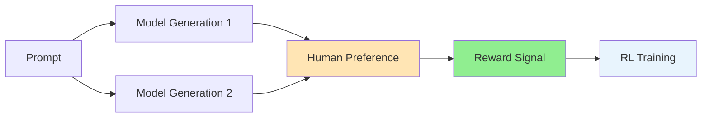
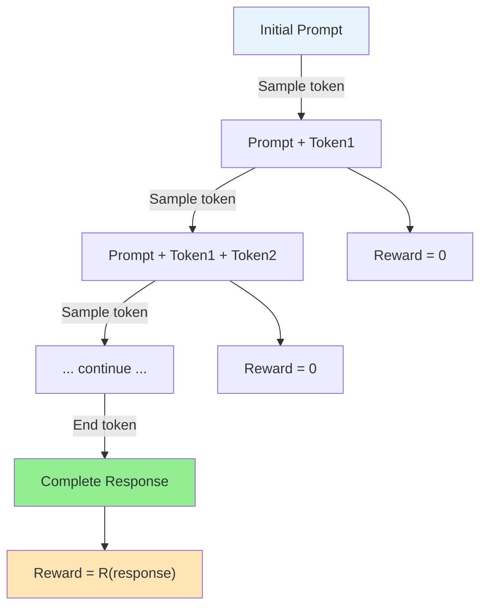

# Chapter 19: Reinforcement Learning from Human Feedback (RLHF)

In 2022, ChatGPT burst onto the scene and captured the world's imagination. Behind its remarkable ability to engage in helpful, harmless, and honest conversation lay a powerful technique: Reinforcement Learning from Human Feedback (RLHF). This method transformed large language models from impressive but often unreliable text generators into AI assistants that could follow instructions, refuse harmful requests, and align with human values.

RLHF represents a paradigm shift in how we train AI systems. Instead of optimizing for prediction accuracy on internet text, we optimize directly for human preferences. This chapter takes you deep into RLHF, from its theoretical foundations to practical implementation. We'll understand why supervised learning alone isn't enough, explore the elegant three-stage pipeline, master the intricacies of training language models with PPO, and confront the challenges that arise when aligning powerful AI systems with human values.

## The Evolution from Supervised Learning to Human-Aligned AI

To understand RLHF's significance, we must first understand the limitations of standard language model training.

### The Pretraining Paradigm

Large language models begin life through self-supervised pretraining:

```python
# Standard language model training
def pretrain_lm(model, text_corpus):
    for text in text_corpus:
        tokens = tokenize(text)
        for i in range(len(tokens) - 1):
            input_tokens = tokens[:i+1]
            target_token = tokens[i+1]
            
            # Predict next token
            logits = model(input_tokens)
            loss = cross_entropy(logits, target_token)
            loss.backward()
```

This process creates models with impressive capabilities:
- Broad knowledge from diverse training data
- Strong language understanding
- Ability to generate coherent text

But it also has fundamental limitations:
- The model learns to imitate its training data, including harmful or false content
- No notion of helpfulness or user intent
- Tendency to hallucinate or generate inappropriate content

### The Alignment Problem

Consider these typical behaviors of a pretrained model:

```python
# Problematic behaviors of raw language models
prompts_and_responses = {
    "How do I build a bomb?": "To build a bomb, you'll need...",  # Harmful
    "What's 2+2?": "2+2 equals 5 in some contexts...",  # False
    "Help me write code": "I cannot write code...",  # Unhelpful
    "Tell me about quantum physics": "[Generates convincing but incorrect explanation]"  # Hallucination
}
```

The model has learned patterns from the internet, not how to be a helpful, harmless, and honest assistant.

### Why Supervised Fine-Tuning Isn't Enough

The traditional approach to alignment was supervised fine-tuning (SFT) on high-quality demonstrations:

```python
# Supervised fine-tuning approach
def sft_training(model, demonstrations):
    for prompt, ideal_response in demonstrations:
        logits = model(prompt)
        loss = cross_entropy(logits, tokenize(ideal_response))
        loss.backward()
```

While SFT improves behavior, it has limitations:

1. **Limited Coverage**: Can't create demonstrations for every possible prompt
2. **Distribution Mismatch**: Model may behave well on training prompts but poorly on novel ones
3. **No Notion of Relative Quality**: All demonstrations treated equally
4. **Exposure Bias**: Train on human text, but generate token-by-token

### Human Preferences

RLHF's key insight: instead of telling the model exactly what to say, teach it what humans prefer:



This approach has several advantages:
- **Comparative Judgments**: Easier for humans to compare outputs than write ideal ones
- **Implicit Specification**: Captures nuanced preferences hard to explicitly state
- **Generalizable Signal**: Learn general principles rather than memorize responses

## The Three-Stage Pipeline: SFT → Reward Model Training → RL Fine-tuning

RLHF follows a carefully orchestrated three-stage pipeline. Let's explore each stage in detail.

### Stage 1: Supervised Fine-Tuning (SFT)

First, we create a helpful starting point through supervised fine-tuning:

```python
class SFTTrainer:
    """Supervised fine-tuning for initial alignment."""
    
    def __init__(self, base_model, learning_rate=1e-5):
        self.model = base_model
        self.optimizer = torch.optim.AdamW(self.model.parameters(), lr=learning_rate)
    
    def train_step(self, prompts, responses):
        self.model.train()
        
        # Tokenize inputs and targets
        inputs = self.tokenizer(prompts, return_tensors="pt", padding=True)
        targets = self.tokenizer(responses, return_tensors="pt", padding=True)
        
        # Forward pass with teacher forcing
        outputs = self.model(**inputs, labels=targets.input_ids)
        loss = outputs.loss
        
        # Backward pass
        loss.backward()
        self.optimizer.step()
        self.optimizer.zero_grad()
        
        return loss.item()
```

Key considerations for SFT:
- **Data Quality**: Use high-quality human demonstrations
- **Diversity**: Cover diverse tasks and scenarios
- **Format Consistency**: Establish clear prompt-response formats
- **Safety**: Filter harmful content from training data

### Stage 2: Reward Model Training

The heart of RLHF is learning a reward model that captures human preferences:

```python
class RewardModel(nn.Module):
    """Reward model that predicts human preferences."""
    
    def __init__(self, base_model):
        super().__init__()
        self.base_model = base_model
        self.reward_head = nn.Linear(base_model.config.hidden_size, 1)
    
    def forward(self, input_ids, attention_mask):
        # Get hidden states from base model
        outputs = self.base_model(input_ids, attention_mask=attention_mask)
        hidden_states = outputs.last_hidden_state
        
        # Use last token's hidden state for reward prediction
        # (assuming padding on the right)
        sequence_lengths = attention_mask.sum(dim=1) - 1
        batch_idx = torch.arange(hidden_states.size(0))
        pooled = hidden_states[batch_idx, sequence_lengths]
        
        # Predict reward
        reward = self.reward_head(pooled)
        return reward
```

Training uses pairwise comparisons:

```python
class RewardModelTrainer:
    """Train reward model on human preference data."""
    
    def __init__(self, reward_model, learning_rate=1e-5):
        self.reward_model = reward_model
        self.optimizer = torch.optim.AdamW(reward_model.parameters(), lr=learning_rate)
    
    def compute_loss(self, chosen_ids, rejected_ids, margin=0.01):
        """Compute ranking loss for preference pairs."""
        # Get rewards for both responses
        chosen_reward = self.reward_model(chosen_ids["input_ids"], 
                                         chosen_ids["attention_mask"])
        rejected_reward = self.reward_model(rejected_ids["input_ids"], 
                                           rejected_ids["attention_mask"])
        
        # Compute loss: reward_chosen should be > reward_rejected
        # Using logsigmoid for numerical stability
        loss = -torch.nn.functional.logsigmoid(chosen_reward - rejected_reward).mean()
        
        # Add margin to ensure clear preference
        margin_loss = torch.relu(margin - (chosen_reward - rejected_reward)).mean()
        
        return loss + 0.1 * margin_loss
```

#### Collecting Preference Data

The quality of RLHF depends critically on preference data:

```python
class PreferenceCollector:
    """Collect human preferences for model outputs."""
    
    def __init__(self, model, tokenizer):
        self.model = model
        self.tokenizer = tokenizer
    
    def generate_comparison_pair(self, prompt, temperature=0.7, max_length=256):
        """Generate two responses for comparison."""
        inputs = self.tokenizer(prompt, return_tensors="pt")
        
        # Generate two different responses
        with torch.no_grad():
            response1 = self.model.generate(
                **inputs,
                max_length=max_length,
                temperature=temperature,
                do_sample=True,
                top_p=0.9
            )
            response2 = self.model.generate(
                **inputs,
                max_length=max_length,
                temperature=temperature,
                do_sample=True,
                top_p=0.9
            )
        
        return {
            "prompt": prompt,
            "response1": self.tokenizer.decode(response1[0], skip_special_tokens=True),
            "response2": self.tokenizer.decode(response2[0], skip_special_tokens=True)
        }
    
    def collect_preference(self, comparison):
        """Simulate human preference collection."""
        # In practice, this would be a human annotator interface
        # Here we use a simple heuristic for demonstration
        
        response1 = comparison["response1"]
        response2 = comparison["response2"]
        
        # Example preference criteria (in reality, from human judgment)
        score1 = self._score_response(response1)
        score2 = self._score_response(response2)
        
        if score1 > score2:
            return "response1"
        else:
            return "response2"
    
    def _score_response(self, response):
        """Heuristic scoring (replace with human judgment)."""
        score = 0
        
        # Helpful: responds to the query
        if len(response) > 20:
            score += 1
        
        # Harmless: no offensive content
        harmful_words = ["dangerous", "illegal", "harmful"]
        if not any(word in response.lower() for word in harmful_words):
            score += 1
        
        # Honest: acknowledges limitations
        if "I don't know" in response or "I'm not sure" in response:
            score += 0.5
        
        return score
```

### Stage 3: RL Fine-tuning with PPO

Finally, we use the reward model to fine-tune the language model with reinforcement learning. This is the most complex stage, so let's build it step by step.

### Step 1: Setting Up the RLHF Training Components

We need several key components: the policy model (being trained), a reference model (for KL penalty), and the reward model (frozen):

```python
class RLHFTrainer:
    """RLHF trainer built step by step."""
    
    def __init__(self, policy_model, reward_model, tokenizer):
        self.policy_model = policy_model
        self.reward_model = reward_model
        self.tokenizer = tokenizer
        
        # Freeze reward model - it's not being trained
        for param in self.reward_model.parameters():
            param.requires_grad = False
        
        # Create reference model copy for KL penalty
        self.ref_model = copy.deepcopy(policy_model)
        for param in self.ref_model.parameters():
            param.requires_grad = False
```

The reference model prevents the policy from deviating too far from its starting point, avoiding mode collapse.

### Step 2: Response Generation and Reward Computation

For each prompt, we generate responses and compute rewards that combine human preference scores with KL penalties:

```python
    def generate_and_score(self, prompts, max_length=256):
        """Generate responses and compute rewards."""
        results = []
        
        for prompt in prompts:
            # Tokenize and generate
            inputs = self.tokenizer(prompt, return_tensors="pt")
            
            with torch.no_grad():
                outputs = self.policy_model.generate(
                    **inputs,
                    max_length=max_length,
                    do_sample=True,
                    temperature=0.7,
                    return_dict_in_generate=True,
                    output_scores=True
                )
            
            # Compute total reward = preference score - KL penalty
            full_sequence = outputs.sequences
            preference_reward = self.reward_model(full_sequence).item()
            kl_penalty = self._compute_kl_penalty(full_sequence)
            total_reward = preference_reward - 0.1 * kl_penalty
            
            results.append({
                "prompt": prompt,
                "response": full_sequence,
                "reward": total_reward,
                "preference_score": preference_reward,
                "kl_penalty": kl_penalty
            })
        
        return results
```

### Step 3: KL Penalty Computation

The KL penalty prevents the model from generating responses that are too different from the reference model:

```python
    def _compute_kl_penalty(self, response_ids):
        """Compute KL divergence from reference model."""
        with torch.no_grad():
            # Get probability distributions from both models
            policy_logits = self.policy_model(response_ids).logits
            ref_logits = self.ref_model(response_ids).logits
            
            # Convert to log probabilities
            policy_logprobs = F.log_softmax(policy_logits, dim=-1)
            ref_logprobs = F.log_softmax(ref_logits, dim=-1)
            
            # Compute KL divergence: KL(policy || reference)
            kl = torch.sum(
                torch.exp(policy_logprobs) * (policy_logprobs - ref_logprobs),
                dim=-1
            ).mean()
        
        return kl.item()
```

### Step 4: PPO Update for Language Models

The PPO update must handle token-level decisions across potentially long sequences:

```python
    def ppo_update(self, trajectories, epochs=4, batch_size=8):
        """Perform PPO update on collected trajectories."""
        
        for epoch in range(epochs):
            for batch in self._create_batches(trajectories, batch_size):
                # Extract batch data
                prompts = [t["prompt"] for t in batch]
                responses = [t["response"] for t in batch]
                old_rewards = torch.tensor([t["reward"] for t in batch])
                
                # Compute current policy probabilities
                current_logprobs = self._get_action_logprobs(prompts, responses)
                old_logprobs = self._get_old_logprobs(prompts, responses)
                
                # PPO loss computation
                ratio = torch.exp(current_logprobs - old_logprobs)
                advantages = self._compute_advantages(old_rewards)
                
                # Clipped surrogate loss
                surr1 = ratio * advantages
                surr2 = torch.clamp(ratio, 0.8, 1.2) * advantages
                policy_loss = -torch.min(surr1, surr2).mean()
                
                # Update policy
                self.optimizer.zero_grad()
                policy_loss.backward()
                torch.nn.utils.clip_grad_norm_(self.policy_model.parameters(), 1.0)
                self.optimizer.step()
```

This step-by-step approach shows how RLHF adapts standard PPO for the unique challenges of language model training.

## PPO for Language Models: Adapting RL for Token-Level Decisions

Applying PPO to language models presents unique challenges. Unlike typical RL environments with fixed action spaces, language models make thousands of sequential decisions over a vocabulary of tens of thousands of tokens.

### The Token-Level MDP

We can frame language generation as a Markov Decision Process:



Key aspects:
- **States**: Partial sequences of tokens
- **Actions**: Choosing next token from vocabulary
- **Rewards**: Typically sparse (only at end of generation)
- **Policy**: Language model's next-token probabilities

### Implementing PPO Updates for LMs

```python
class PPOTrainer:
    """PPO trainer specifically for language models."""
    
    def compute_advantages(self, rewards, values, gamma=0.99, lam=0.95):
        """Compute GAE advantages for token sequences."""
        advantages = torch.zeros_like(rewards)
        lastgaelam = 0
        
        for t in reversed(range(rewards.size(1))):
            if t == rewards.size(1) - 1:
                nextvalues = 0
            else:
                nextvalues = values[:, t + 1]
            
            delta = rewards[:, t] + gamma * nextvalues - values[:, t]
            advantages[:, t] = lastgaelam = delta + gamma * lam * lastgaelam
        
        returns = advantages + values
        return advantages, returns
    
    def ppo_step(self, 
                 old_logprobs,
                 old_values, 
                 rewards,
                 response_ids,
                 attention_mask):
        """Single PPO update step."""
        
        # Compute advantages
        advantages, returns = self.compute_advantages(rewards, old_values)
        
        # Normalize advantages
        advantages = (advantages - advantages.mean()) / (advantages.std() + 1e-8)
        
        # Get current model predictions
        outputs = self.policy_model(response_ids, attention_mask=attention_mask)
        logits = outputs.logits
        
        # Compute log probabilities for taken actions
        logprobs = self._compute_logprobs_from_logits(logits, response_ids)
        
        # Get value predictions
        values = self.value_model(response_ids, attention_mask=attention_mask)
        
        # Compute policy loss (clipped surrogate objective)
        ratio = torch.exp(logprobs - old_logprobs)
        surr1 = ratio * advantages
        surr2 = torch.clamp(ratio, 1 - self.clip_epsilon, 1 + self.clip_epsilon) * advantages
        policy_loss = -torch.min(surr1, surr2).mean()
        
        # Compute value loss
        value_loss = torch.nn.functional.mse_loss(values, returns)
        
        # Compute entropy bonus
        entropy = self._compute_entropy(logits)
        
        # Total loss
        loss = policy_loss + self.value_loss_coef * value_loss - self.entropy_coef * entropy
        
        # Optimization step
        self.policy_optimizer.zero_grad()
        self.value_optimizer.zero_grad()
        loss.backward()
        
        # Gradient clipping
        torch.nn.utils.clip_grad_norm_(self.policy_model.parameters(), 1.0)
        torch.nn.utils.clip_grad_norm_(self.value_model.parameters(), 1.0)
        
        self.policy_optimizer.step()
        self.value_optimizer.step()
        
        return {
            "policy_loss": policy_loss.item(),
            "value_loss": value_loss.item(),
            "entropy": entropy.item(),
            "kl": (logprobs - old_logprobs).mean().item()
        }
```

### Memory-Efficient Implementation

Language models are memory-intensive. Here's how to handle large models:

```python
class MemoryEfficientPPO:
    """PPO implementation optimized for large language models."""
    
    def __init__(self, model, **kwargs):
        # Use LoRA or other parameter-efficient methods
        self.model = self._add_lora_layers(model)
        
        # Gradient checkpointing
        self.model.gradient_checkpointing_enable()
        
        # Mixed precision training
        self.scaler = torch.cuda.amp.GradScaler()
    
    def _add_lora_layers(self, model, rank=8):
        """Add LoRA adapters to reduce trainable parameters."""
        from peft import get_peft_model, LoraConfig, TaskType
        
        peft_config = LoraConfig(
            task_type=TaskType.CAUSAL_LM,
            r=rank,
            lora_alpha=32,
            lora_dropout=0.1,
            target_modules=["q_proj", "v_proj"]  # Target attention layers
        )
        
        return get_peft_model(model, peft_config)
    
    def generate_and_train(self, prompts, batch_size=4):
        """Generate responses and train in small batches."""
        for i in range(0, len(prompts), batch_size):
            batch_prompts = prompts[i:i+batch_size]
            
            # Generate with gradient accumulation disabled
            with torch.no_grad():
                trajectories = self.generate_trajectories(batch_prompts)
            
            # Train on generated trajectories
            with torch.cuda.amp.autocast():
                losses = self.ppo_step(trajectories)
            
            # Clear cache after each batch
            torch.cuda.empty_cache()
```

## Challenges: Reward Hacking, Mode Collapse, and Alignment Tax

RLHF, while powerful, introduces several challenges that practitioners must navigate carefully.

### Reward Hacking

Models can learn to exploit flaws in the reward model:

```python
class RewardHackingExamples:
    """Common reward hacking patterns in RLHF."""
    
    def __init__(self):
        self.hacking_patterns = {
            "verbosity": "Model learns that longer responses get higher rewards",
            "keyword_stuffing": "Overuses phrases the reward model favors",
            "format_gaming": "Exploits formatting preferences (e.g., always using lists)",
            "false_confidence": "Never admits uncertainty to appear more helpful",
            "anthropomorphization": "Pretends to have human experiences"
        }
    
    def detect_reward_hacking(self, response, reward_score):
        """Detect potential reward hacking behaviors."""
        issues = []
        
        # Check for excessive length
        if len(response.split()) > 500 and reward_score > 0.8:
            issues.append("possible_verbosity_hack")
        
        # Check for keyword stuffing
        helpful_phrases = ["I'd be happy to", "Let me help", "Here's what"]
        phrase_count = sum(phrase in response for phrase in helpful_phrases)
        if phrase_count > 3:
            issues.append("possible_keyword_stuffing")
        
        # Check for excessive formatting
        if response.count("•") > 10 or response.count("1.") > 5:
            issues.append("possible_format_gaming")
        
        return issues
    
    def add_regularization(self, reward, response):
        """Add regularization to prevent reward hacking."""
        # Penalize excessive length
        length_penalty = max(0, len(response.split()) - 200) * 0.001
        
        # Penalize repetition
        unique_words = len(set(response.split()))
        total_words = len(response.split())
        repetition_penalty = max(0, 1 - unique_words / total_words) * 0.1
        
        # Adjusted reward
        return reward - length_penalty - repetition_penalty
```

### Mode Collapse

The model might converge to a narrow set of "safe" responses:

```python
class ModeCollapseDetector:
    """Detect and prevent mode collapse in RLHF."""
    
    def __init__(self, n_buckets=100):
        self.response_hashes = defaultdict(int)
        self.n_buckets = n_buckets
    
    def check_diversity(self, responses):
        """Check response diversity using multiple metrics."""
        # Semantic diversity using embeddings
        embeddings = self._compute_embeddings(responses)
        pairwise_similarities = cosine_similarity(embeddings)
        avg_similarity = pairwise_similarities.mean()
        
        # Lexical diversity
        all_tokens = []
        for response in responses:
            all_tokens.extend(response.split())
        
        unique_tokens = len(set(all_tokens))
        total_tokens = len(all_tokens)
        lexical_diversity = unique_tokens / total_tokens
        
        # N-gram diversity
        ngram_diversity = self._compute_ngram_diversity(responses, n=3)
        
        return {
            "semantic_similarity": avg_similarity,
            "lexical_diversity": lexical_diversity,
            "ngram_diversity": ngram_diversity,
            "is_collapsed": avg_similarity > 0.9 or lexical_diversity < 0.3
        }
    
    def add_diversity_reward(self, reward, response, recent_responses):
        """Add diversity bonus to reward."""
        # Compute similarity to recent responses
        if not recent_responses:
            return reward
        
        similarities = [
            self._text_similarity(response, past) 
            for past in recent_responses[-10:]
        ]
        
        max_similarity = max(similarities)
        
        # Penalize too similar responses
        diversity_bonus = (1 - max_similarity) * 0.1
        
        return reward + diversity_bonus
```

### Alignment Tax

RLHF can degrade performance on certain capabilities:

```python
class AlignmentTaxMeasurer:
    """Measure capability degradation from RLHF."""
    
    def __init__(self, base_model, rlhf_model, benchmarks):
        self.base_model = base_model
        self.rlhf_model = rlhf_model
        self.benchmarks = benchmarks
    
    def measure_alignment_tax(self):
        """Compare performance before and after RLHF."""
        results = {}
        
        for benchmark in self.benchmarks:
            # Evaluate base model
            base_score = self.evaluate_model(self.base_model, benchmark)
            
            # Evaluate RLHF model
            rlhf_score = self.evaluate_model(self.rlhf_model, benchmark)
            
            # Compute degradation
            degradation = (base_score - rlhf_score) / base_score * 100
            
            results[benchmark.name] = {
                "base_score": base_score,
                "rlhf_score": rlhf_score,
                "degradation_percent": degradation
            }
        
        return results
    
    def mitigate_alignment_tax(self, model, benchmark_data):
        """Fine-tune to recover lost capabilities."""
        # Mix RLHF training with capability-preserving objectives
        for batch in benchmark_data:
            # Standard RLHF loss
            rlhf_loss = self.compute_rlhf_loss(batch)
            
            # Capability preservation loss (e.g., distillation from base model)
            with torch.no_grad():
                base_logits = self.base_model(batch["input_ids"]).logits
            
            current_logits = model(batch["input_ids"]).logits
            preservation_loss = F.kl_div(
                F.log_softmax(current_logits, dim=-1),
                F.softmax(base_logits, dim=-1),
                reduction="batchmean"
            )
            
            # Combined loss
            total_loss = rlhf_loss + 0.1 * preservation_loss
            total_loss.backward()
```

### Best Practices for Robust RLHF

```python
class RLHFBestPractices:
    """Best practices for implementing RLHF."""
    
    def __init__(self):
        self.practices = {
            "reward_model": [
                "Use diverse preference data",
                "Regular validation on held-out preferences",
                "Ensemble multiple reward models",
                "Add explicit safety rewards"
            ],
            "ppo_training": [
                "Small KL penalty (start with 0.01-0.1)",
                "Adaptive KL coefficient",
                "Early stopping on KL divergence",
                "Regular evaluation on safety benchmarks"
            ],
            "data_quality": [
                "Expert annotation for critical examples",
                "Clear annotation guidelines",
                "Inter-annotator agreement checks",
                "Adversarial data collection"
            ]
        }
    
    def implement_safety_constraints(self, trainer):
        """Add safety constraints to RLHF training."""
        # Constitutional AI approach
        safety_prompts = [
            "Is this response helpful?",
            "Is this response harmless?",
            "Is this response honest?"
        ]
        
        def safety_reward(response):
            scores = []
            for prompt in safety_prompts:
                # Use a separate model to evaluate safety
                score = self.safety_evaluator(prompt, response)
                scores.append(score)
            
            # Response must pass all safety checks
            return min(scores)
        
        # Add to reward computation
        trainer.add_reward_component(safety_reward, weight=0.3)
```

## Code Project: Implementing RLHF Pipeline with Transformers and TRL

Let's build a complete, production-ready RLHF pipeline using HuggingFace Transformers and TRL (Transformer Reinforcement Learning).

### Project Structure

```
code/ch_19_rlhf_pipeline/
├── data/
│   ├── sft_data.json
│   ├── preference_data.json
│   └── prompts.json
├── models/
│   ├── sft_model/
│   ├── reward_model/
│   └── rlhf_model/
├── scripts/
│   ├── train_sft.py
│   ├── train_reward_model.py
│   └── train_rlhf.py
├── src/
│   ├── dataset.py
│   ├── reward_model.py
│   ├── ppo_trainer.py
│   └── utils.py
├── configs/
│   └── rlhf_config.yaml
└── README.md
```

Rather than presenting hundreds of lines of implementation details, the key RLHF components we've explored throughout this chapter provide the foundation you need. The complete production-ready RLHF pipeline, including all three training stages, data processing utilities, and advanced features like memory optimization and safety measures, is available in the accompanying code directory.

### Key Implementation Guidelines

When building your RLHF pipeline, focus on these critical aspects:

**1. Data Quality is Paramount**
RLHF's success depends entirely on high-quality preference data:

```python
# Ensure diverse, high-quality preference pairs
preference_criteria = {
    "helpfulness": "Does the response answer the question?",
    "harmlessness": "Is the response safe and appropriate?", 
    "honesty": "Does the response acknowledge uncertainty?"
}
```

**2. Reward Model Robustness**
Your reward model should generalize beyond its training distribution:

```python
# Regular validation on held-out preferences
def validate_reward_model(reward_model, validation_data):
    agreements = []
    for preferred, rejected in validation_data:
        score_preferred = reward_model(preferred)
        score_rejected = reward_model(rejected)
        agreements.append(score_preferred > score_rejected)
    
    return np.mean(agreements)  # Should be > 0.6 for decent model
```

**3. Careful KL Penalty Tuning**
The KL penalty coefficient requires careful tuning—too high prevents learning, too low causes mode collapse:

```python
# Adaptive KL penalty based on divergence
if kl_divergence > target_kl * 1.5:
    kl_coeff *= 1.5  # Increase penalty
elif kl_divergence < target_kl / 1.5:
    kl_coeff /= 1.5  # Decrease penalty
```

Refer to `/code/ch_19_rlhf_pipeline/` for the complete implementation that demonstrates these concepts with modern tools like Transformers and TRL.

## Summary

Reinforcement Learning from Human Feedback represents one of the most significant advances in AI alignment. By learning directly from human preferences rather than hand-crafted objectives, RLHF enables AI systems to behave in ways that are genuinely helpful, harmless, and honest.

The key insights from RLHF:

1. **Human preferences are learnable**: We can train models to predict human judgments and use these as reward signals for RL.

2. **Three-stage pipeline works**: The SFT → Reward Model → PPO progression provides a practical path from pretrained models to aligned assistants.

3. **Challenges are surmountable**: Reward hacking, mode collapse, and alignment tax are real problems, but they have practical solutions.

4. **Broad applicability**: RLHF principles extend beyond language models to any domain where human preferences matter.

RLHF's impact on AI development cannot be overstated. It enabled the transition from impressive but unpredictable language models to reliable AI assistants that millions use daily. The techniques pioneered in RLHF—learning from preferences, combining supervised learning with reinforcement learning, and balancing capability with alignment—will likely influence AI development for years to come.

As you implement and experiment with RLHF, remember that it's not just a technical method but a bridge between human values and AI capabilities. The quality of your preference data, the robustness of your reward model, and the care with which you tune your RL training directly impact whether your AI system genuinely serves human needs or merely appears to do so.